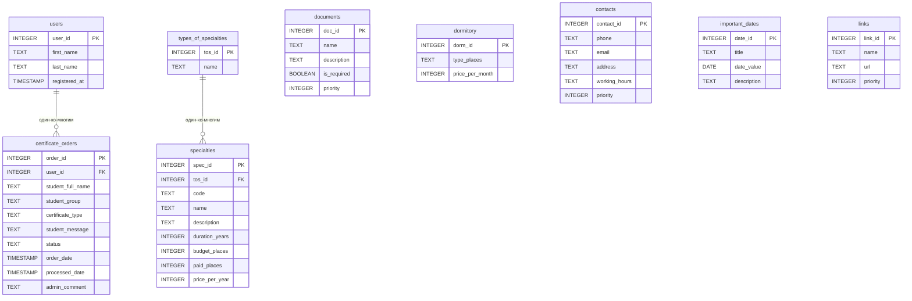

 Министерство образования, науки и молодежной политики Республики Коми 

 ГПОУ "Сыктывкарский политехнический техникум" 

 Выпускная Квалификационная Работа 

 Тема: Создание бота для студентов и абитуриентов ГПОУ "СПТ" в мессенджере "MAX"

 Выполнил 

 студент 4 курса 

 414 группы 

 Блинников Артём Николаевич 

 Проверил 

 _____________________________ 

 Дата проверки: ___________ 

## Содержание
1. Введение
 

2. Глава 1. Теория
   - анализ существующих информационных ресурсов
   - анализ потребностей студентов и абитуриентов
   - терминология
   - требования к разрабатываему чат-боту
 

3. Глава 2. Практика
   - составление вопросов и ответов
   - разработка базы данных
   - разработка кода чат-бота
   - методы запросов
   - тестирование
 

4. Глава 3. Экономика
   - затраты на разработку
   - затраты на сервер
 

5. Заключение
 

6. Список источников
 

7. Приложения
 

# **
Глава 1
**
## 1.1 - анализ существующих информационных ресурсов
В настоящее время ГПОУ "СПТ" имеет несколько ресурсов, предназначенных для студентов, абитуриентов и родителей учеников. Некоторые из них:
1) Группа ВКонтакте - сообщество в социальной сети ВК, где публикуются новости и жизнь техникума. В описании группы есть лишь адрес и ссылка на сайт.
2) Канал в мессенджере МАКС - сообщество, в котором все так же выкладывают новости. В описании канала - никаких контактов, только представление техникума.
3) Сайт - более полезный ресурс. Есть вся нужная информация, но чтобы её найти, нужно много действий.

Для более детального понимания ситуации был проведен сравнительный анализ существующих информационных ресурсов ГПОУ "СПТ" по следующим критериям: доступность информации, удобство навигации, актуальность данных, возможность обратной связи.

| Ресурс                 | Плюсы                                                                                    | Минусы                                                                                  | Оценка 
|------------------------|------------------------------------------------------------------------------------------|-----------------------------------------------------------------------------------------|--------
|Группа ВКонтакте        | Быстрое оповещение о новостях, возможность комментировать                                | Информация не структурирована, важные сообщения теряются в ленте, нет поиска по истории | 3/5    
|Канал в мессенджере Макс| Мгновенная доставка сообщений, защищенный канал связи                                    | Только новостной формат, отсутствует возможность задать вопрос, нет базы знаний         | 2,5/5  
|Официальный сайт        | Полная информация обо всех аспектах деятельности техникума, документы в открытом доступе | Сложная многоуровневая навигация, требуется много действий для поиска нужной информации | 3,5/5  
|Групповые чаты студентов| Быстрый ответ от одногруппников, неформальное общение                                    | Информация не сохраняется, нет гарантии достоверности, сообщения теряются в потоке      | 2/5    
|Разрабатываемый чат-бот | Вся информация в одном месте, навигация по номерам, круглосуточная доступность           | Требуется время на наполнение базы данных                                               | 5/5    
 
Как видно из таблицы, существующие ресурсы имеют ряд недостатков, которые призван решить разрабатываемый

чат-бот. Основные проблемы текущих решений:

1) Фрагментация информации - данные разбросаны по разным платформам
2) Отсутствие структуры - информация не разделена по категориям
3) Сложность поиска - чтобы найти нужные сведения, требуется несколько кликов и переходов
4) Недостоверность - в неофициальных источниках информация может быть устаревшей или неверной

## 1.2 - анализ потребностей студентов и абитуриентов
В ходе проведения опроса студентов были заданы следующие вопросы:

1) Какая информацией вы пользуетесь чаще всего?
2) Какой ресурс вы используете для получения информации для учёбы?
3) Какой источник информации вы бы хотели увидеть (или доработать)?
4) Как часто вы используете мессенджеры?
5) Будете ли вы готовы использовать чат-бота?

Было опрошено 500 студентов от первого до четвертого курса, с разными специальностями.
Результаты опроса приведены в процентном соотношении, и представлены ниже:

Вопрос 1, в котором можно было выбрать несколько вариантов ответа:

- 95% - расписание звонков
- 78% - контакты администрации
- 72% - ссылки на расписание занятий
- 65% - информация про общежитие
- 45% - правила и уставы техникума
- 38% - внеурочные активности

Вопрос 2:

- 78% - групповые чаты с одногруппниками
- 12% - официальный сайт
- 10% - устные объявления.

Вопрос 3:

- 90% - доработка сайта или создание чат-бота
- 5% - только доработка сайта и публичных групп
- 5% - оставили бы как есть на данный момент

Вопрос 4:

- 95% - ежедневно
- 4% - несколько раз в неделю
- 1% - 1-2 раза в неделю

Вопрос 5:

- 98% - однозначно ДА
- 1% - скорее да, чем нет
- 1% - однозначно НЕТ

Исходя из результатов опроса студентов, с уверенностью можно сказать, что опрошенные заинтересованны в развитии информационных систем.
Подавляющему большинству студентов хотелось бы получать информацию в одном определенном месте в удобном формате в виде чат-бота.
Ответы на пятый вопрос дают подтверждение доводу, описанному выше.

## 1.3 - терминология
**Мессенджер** - Это программное обеспечение для мгновенного обмена сообщениями между зарегистрированными пользователями через интернет.
Слово происходит от английского messenger "курьер", "посланник".

К примеру - Российский мессенджер "Макс" с акцентом на безопасность, поддержкой групповых чатов, голосовых и видеозвонков,
обменов файлами, ботов и бизнес-интеграции.

При использовании мессенджеров важно учитывать вопросы безопасности и конфиденциальности, например, настраивать двухфакторную аутентификацию, избегать подозрительных ссылок и не передавать конфиденциальные данные в переписке.

**Чат-бот** - Это программа, которая имитирует диалог с человеком через текстовые или голосовые сообщения, выполняя автоматизированные задачи или помогая решать типовые проблемы.

Это виртуальный помощник, который работает круглосуточно, не устаёт и может одновременно общаться с тысячами пользователей.

Области применения чат-ботов очень обширны. Средни них - клиентская поддержка, банковские сферы, медицина, развлечения и образование.

**Токен бота** - Это уникальный «пароль» бота в мессенджере Макс. По этому токену система понимает, что сообщения предназначены именно этому боту, а не другому.

**СУБД** - система управления базами данных. Это инструмент, позволяющий работать с базами данных.

**API (Application Programming Interface)** - это набор правил и инструментов, с помощью которого одна программа может взаимодействовать с другой.
В контексте разработки ботов API мессенджера предоставляет методы для отправки и получения сообщений, управления чатами, работы с кнопками и т.д.

**Middleware** - это промежуточное программное обеспечение, которое обрабатывает запросы до того, как они достигнут основного обработчика.
В чат-ботах middleware может использоваться для логирования, аутентификации пользователей, обработки ошибок и других сквозных задач.

**Dispatcher (диспетчер)** - это компонент, который отвечает за маршрутизацию входящих сообщений к соответствующим обработчикам. Диспетчер анализирует тип события (текстовое сообщение, команда) и вызывает нужную функцию.

**SQL (Structured Query Language)** - язык структурированных запросов, используемый для управления реляционными базами данных. SQL позволяет выполнять операции создания, чтения, обновления и удаления данных.

**CRUD операции** - акроним, обозначающий четыре базовые операции с данными: Create *(создание)*, Read *(чтение)*, Update *(обновление)*, Delete *(удаление)*.
Эти операции являются основой работы любого приложения, взаимодействующего с базой данных.

## 1.4 - требования к разрабатываему чат-боту
### 1.4.1 - метод разработки
Есть два метода разработки чат-ботов: Конструктор и ручное программирование. Методы разработки выбираются исходя из поставленных задач, выгоды, затрачиваемых ресурсов.
Конструктор - инструмент, который позволяет создать бота и настроить его на работу без знаний языков программировани. Они могут полезны для незначительных задач, где не нужна сложная логика.

К самым популярным конструкторам ботов относятся:

*BotMan* - платный (от 900 рублей в месяц), функционал очень маленький.

*Unisender* - платный (от 950 рублей в месяц), функций хватает исключительно на ботов для рассылок.

*PuzzleBot* - платный (от 1500 рублей в месяц), функционал большой, но он все так же не позволяет сделать то, что нужно реализовать в чат-боте для "СПТ".

Ручное программирование - метод разработки чат-бота с использованием языков программирования. Этот метод требует знаний языков программирования, библиотек разработки.
Однако, если использовать этот метод работы с чат-ботом, можно достигнуть желаемого результата.

К языкам программирования, на которых можно написать чат-бота, относятся:

**Python (пайтон)** - высокоуровневый язык программирования общего назначения. Является одним из самых используемых. Простой, понятный и быстрый.

**TypeScript(тайпскрипт)** - язык программирования, доработанная версия JavaScript. Используется намного реже, чем python из-за его низкой скорости. 

**Java(джава) / node.js** - это объектно-ориентированный, строго типизированный язык программирования общего назначения.

На данный момент - самый малоиспользуемый язык программирования ботов из-за лучших аналогов.

Исходя из вышеперечисленного, можно сделать вывод, что создание чат-бота будет наиболее удобным и эффективным, если писать его на языке Python. Этот метод разработки и будет использован в работе.
Для обоснования выбора языка программирования был проведен сравнительный анализ вышеперечисленных языков для разработки чат-ботов.

Ниже представлена таблица сравнений языков программирования ботов:
 
|Параметр | Python | Node.js (JavaScript) | TypeScript
|---------|--------|----------------------|-------
|Скорость разработки | Высокая | Средняя | Низкая
|Скорость выполнения | Средняя | Высокая | Очень высокая
|Порог входа | Низкий | Средний | Высокий
|Экосистема для ботов | Обширная | Хорошая  | Ограниченная
|Поддержка SQLite | Встроенная в стандартную библиотеку | Через сторонние модули | Через сторонние модули
|Количество библиотек | Более 300 000 на PyPI | ~2 000 000 на npm | ~250 000 на pkg.go.dev
|Сообщество | Огромное, множество гайдов | Огромное, особенно в веб-разработке | Растущее
|Типизация | Динамическая (или опциональная через аннотации) | Динамическая | Строгая статическая
|Простота отладки | Высокая (интерактивная консоль, pdb) | Средняя | Высокая
 
Дополнительно был проведен анализ популярности языков среди разработчиков ботов на основе опроса в сообществах разработчиков (опрошено 150 человек). Результаты показали, что:

- 67% респондентов используют Python для разработки ботов

- 22% используют Node.js

- 8% используют TypeScript

- 3% используют другие языки (Java, PHP, C#)

Таким образом, выбор Python в качестве основного языка разработки является обоснованным и соответствует современным тенденциям в области создания чат-ботов.

### 1.4.2 - метод хранения информации  
В случае с чат-ботами предоставлено два способа хранения данных: внутри кода и вне кода.
Хранение данных внутри кода подразумевает, что определенные данные будут храниться среди исполняемого кода, что невыгодно как для производительности, так и для редактирования этих самых данных. Такой тип хранения подходит исключительно для тех данных, которые меняются крайне редко, либо не меняются вовсе.

Хранения данных вне кода - это хранение, которое реализованно отдаленно от кода. К примеру, базы данных, сервера. Этот способ удобен для тех случаев, где данные могут меняться часто. К примеру, в случае с чат-ботом для техникума, это могут быть ссылки на актуальное расписание занятий, или о внеурочных занятиях.
Исходя из вышеперечисленного, было выбрано два метода хранения одновременно.

### 1.4.3 - обоснование выбранных методов
Для разработки бота был выбран язык программирования *Python*. Язык является легким в освоении, используется повсеместно в разработке программного обеспечения. Python применяется в **Веб-разработке**, **Машинном обучении**, **Автоматизации задач**, **Образовании**.
Используется в таких компаниях, как **"ВКонтакте"**, **"Яндекс"**, **"Сбербанк"**.

Система хранения в боте выбрана двойная: внутри кода и вне его пределов.
Внутри кода будет храниться постоянное расписание, которое не меняется. Вне кода будет храниться все остальные данные. Для этого будет использоваться база данных.

Ниже представлена таблица с сравнением двух самых популярных СУБД:
 
|Параметр | PostgreSQL | SQLite3
|---------|------------|--------
|Установка | Требует установки отдельного серверного пакета, настройки служб, создания пользователей и паролей | Не требует установки - встроен в стандартную библиотеку Python, доступен через import sqlite3
|Настройка | Необходимо редактирование конфигурационных файлов, настройка прав доступа, сетевых портов | Не требует настройки - база данных представляет собой обычный файл с расширением .db
|Время развёртывания | 30–60 минут (включая установку, настройку, создание пользователя и базы данных) | Менее 1 минуты (создание файла БД первой командой sqlite3.connect())
|Оперативная память | Минимум 512 МБ (рекомендуется 1–2 ГБ), процессор с частотой от 1 ГГц | Не требует выделенной памяти - использует память процесса Python (обычно <10 МБ)
|Дисковое пространство | ~50 МБ для установки + размер базы данных | 0 МБ для установки (встроен) + размер базы данных
|Отдельный сервер | Рекомендуется выделенный сервер или VPS | Может работать на любом компьютере, включая обычный ПК или Raspberry Pi
|Сетевые требования | Требует сетевого доступа (порт 5432 обычно), настройка сетевых экранов | Не требует сети - БД доступна только локальному процессу
|Затраты на сервер | Требует отдельного сервера или VPS (~500–1000 руб./мес.) | Может работать на любом компьютере - 0 руб./мес.
|Затраты на сопровождение | Требует квалифицированного администратора (минимум 10–20 часов в месяц) | Не требует сопровождения - 0 руб./мес.
 
Для проекта с предполагаемой нагрузкой до 2000 пользователей и до 50 одновременных запросов SQLite3 является оптимальным выбором.

Исходя из вышеперечисленного, в боте будет использован язык программирования python из-за его скорости, простоты и доступности, в связке с базой данных sqlite3.

# **
Глава 1
**
## 2.1 Составление вопросов и ответов

Исходя из данных опроса в **главе 1 пункт 1.2** было вынесено решение о создании следующих категорий:

1) Специальности
 
2) Общежитие
   
3) Расписание
   
4) Контакты
   
5) Важные даты
    
6) Правила и уставы
    
7) Абитуриентам
    
8) Внеурочные активности
    

Категория "Специальности" хранит в себе несколько подкатегорий, которые описывают тип специальности. 
При выборе определенного направления сразу предоставляются профессии по этому направлению, количество бюджетных и платных мест, цены на обучения, сроки обучения.

- Категория "Общежитие" содержит всю информацию о предоставлении мест в общежитии. Хранит данные о цене проживания, о адресах общежитий.

- Категория "Расписание" содержит статичный текст расписания звонков. Внизу сообщения присутствует кнопка возврата в главное меню.

- Категория "Контакты" хранит данные о приемной комиссии, адреса учебных заведений, часы работы.

- Категория "Важные даты" является способом информирования студентов о каких-либо событиях. Например, общественные мероприятия, начало приемной кампании.

- Категория "Правила и уставы" содержит ссылки на устав техникума, с которыми студенты должны быть ознакомлены.

- Категория "Абитуриентам" является одной из главнейших категорий. Содержит информацию о необходимых документах для поступления, льготах.

- Категория "Внеурочные активности" содержит в себе информацию о дополнительных занятиях, секциях. Например, футбол, баскетбол.

В боте выбор категории вопроса реализован в виде системы навигации по номерам, на которые нужно нажать для ознакомления с информацией.
Так же будет добавлена **функция заказа справок**, которая так же будет являться активной кнопкой в меню. Навигация по боту осуществляется через отправку номера раздела (от 1 до 9).

*Кнопка "0" позволяет вернуться в главное меню из любого раздела*.

## 2.2 Разработка базы данных

### 2.2.1 Логическая схема базы данных

В базе данных будет хранится следующее:

- данные о пользователях *(users)*
  
- данные о специальностях *(specialties)*
  
- данные о типах специальностей *(types_of_specialties)*
  
- данные о необходимых документах для поступления *(documents)*
  
- данные об общежитии *(dormitory)*
  
- данные о важных датах *(important_dates)*
  
- данные о способе контактов с администрацией *(contacts)*
  
- данные о ссылках на документы *(links)*
  
- данные о внеурочных активностях *(sports_activities)*
  
- данные о заказанных справках *(certificate_orders)*

Перечень таблиц базы данных:

- **users** - хранение информации о пользователях
  
- **certificate_orders** - заказы справок от студентов
  
- **types_of_specialties** - типы специальностей (направления подготовки)
  
- **specialties** - специальности (принадлежат определенному типу)
  
- **documents** - список документов для поступления
  
- **dormitory** - информация о стоимости проживания в общежитии
  
- **important_dates** - важные даты и события
  
- **contacts** - контактная информация
  
- **links** - ссылки на документы и правила
  
- **sports_activities** - внеурочные активности

Связи между таблицами:

- **users ↔ certificate_orders** *(один-ко-многим)*: один пользователь может заказать несколько справок. Связь реализована через внешний ключ user_id в таблице certificate_orders, который ссылается на user_id в таблице users. 
Это позволяет при удалении пользователя автоматически удалять его заказы *(CASCADE)*.

- **types_of_specialties ↔ specialties** *(один-ко-многим)*: один тип специальности содержит множество конкретных специальностей. Связь реализована через внешний ключ tos_id в таблице specialties. 
Это позволяет при запросе специальностей определенного типа быстро получать все связанные записи.

- **certificate_orders** использует поле *status* для отслеживания состояния заказа *(new/processed)*. Это позволяет администратору видеть только новые заказы, не отвлекаясь на уже обработанные.

Обоснование выбранных типов данных:

- **INTEGER PRIMARY KEY** - для уникальных идентификаторов, автоинкрементное увеличение

- **TEXT** - для строковых данных (имена, названия, описания)
  
- **TIMESTAMP** - для хранения даты и времени с автоматической подстановкой CURRENT_TIMESTAMP
  
- **BOOLEAN** - для бинарных флагов (например, is_required в таблице documents)

- **FOREIGN KEY** - для обеспечения ссылочной целостности между таблицами

Благодаря такой системе хранения информация не теряется внутри базы. Данные имеют четкую структуру, имеют связь между собой, что оказывает положительное влияние на возможность расширять базу, видоизменять её.

### 2.2.2 Индексы и оптимизация

**Индексы в базах данных** - это специальные структуры данных, которые ускоряют поиск, сортировку и обработку информации в таблицах. Они позволяют СУБД *быстро находить нужные строки без необходимости полного сканирования таблицы*.

Без индексов SQLite при каждом поиске вынужден просматривать все записи в таблице *(это называется **full table scan**)*. С индексами он обращается к индексу и сразу находит нужные строки.

Основными функциями индексов являются:

- **Ускорение выполнения запросов на выборку данных (SELECT).** При наличии индекса СУБД может быстро находить строки, соответствующие условиям запроса *(например, в предложении WHERE)*, вместо последовательного перебора всех записей.

- **Повышение производительности JOIN-запросов.** Индексы по столбцам, которые участвуют в соединении таблиц, позволяют сократить время поиска соответствующих строк.

- **Ускорение сортировки данных.** Если данные запрашиваются в отсортированном виде *(ORDER BY)* по столбцу с индексом, СУБД может избежать дополнительной операции сортировки.

- **Ускорение группировки данных.** Операции группировки *(GROUP BY)* могут выполняться быстрее при наличии подходящих индексов.

- **Обеспечение уникальности значений.** Уникальные индексы *(Unique Indexes)* гарантируют, что в индексируемом столбце или наборе столбцов не будет дублирующихся значений. Первичный ключ таблицы (Primary Key) по умолчанию всегда является уникальным индексом.

- **Снижение нагрузки на ресурсы.** Благодаря индексам СУБД обрабатывает меньший объём данных, что сокращает количество операций ввода-вывода, снижает нагрузку на процессор и оперативную память.

Для оптимизации поиска данных и работы с ними были созданы следующие индексы:

- **idx_certificate_orders_user_id** - ускоряет поиск заказанных справок от студента.

- **idx_certificate_orders_status** - помогает находить и показывать новые заказы на справки.

- **idx_certificate_orders_order_date** - сортирует заказанные справки по дате заказа.

- **idx_specialties_tos_id** - помогает отображать только те профессии, которые связаны с выбранным направлением.

- **idx_links_link_type_id** - нужен для отображения ссылок только определенного формата и типов.

С помощью индексов снижается нагрузка на базу при показе данных.

## 2.3 Разработка кода чат-бота
В этом разделе будут показаны методы разработки классов и методов чат-бота.

### 2.3.1 Создание класса логирования

Логирование является процессом записи событий в чат-боте. Записи в логах помогают понять, в чем может быть ошибка, чтобы быстрее её устранить.

Ниже представлен фрагмент кода, отвечающий за логирование:
 

logging.basicConfig(

level=logging.INFO,
    
format='%(asctime)s - %(name)s - %(levelname)s - %(message)s',
    
handlers=[
    
logging.StreamHandler(sys.stdout),
        
logging.FileHandler('bot.log', encoding='utf-8')])
        
logger = logging.getLogger(__name__)

 
В этом чат-боте логирование ведется в формате "Время - название - тип логирования - основная информация лога".

Пример логирования:
 

2025-05-31 10:15:23,479 - __main__ - INFO - Запуск бота для Max...
 

Этот лог показывает, что бот был успешно запущен и готов выполнять задачи.

### 2.3.2 Создание класса со статичными данными

Класс содержит в себе данные о базе, токене, идентификаторе администратора бота, а так же статичные данные. В случае этого чат-бота - расписание звонков.

Пример кода представлен ниже:
 

class Config:

def__init__(self):
    
base_dir = os.path.dirname(os.path.abspath(__file__))
        
db_dir = os.path.join(base_dir, 'data')
        
if not os.path.exists(db_dir):

os.makedirs(db_dir)
            
self.db_path = os.path.join(db_dir, 'база_данных.db')
        
self.bot_token = 'токен_бота'
        
self.admin_ids = [ID_администратора]
        
self.bell_schedule = """
        
🕐 РАСПИСАНИЕ ЗВОНКОВ

(далее идет текст с расписанием)
"""
 

### 2.3.3 Создание основного класса

Основной класс бота содержит в себе функции, которые сам бот должен выполнять. В этом классе хранятся команды, функции, отвечающие за работу с базой данных, отправкой и приемом сообщений.

Структура класса AdmissionsBot:
 

class AdmissionsBot:

    def __init__(self, token: str, db: Database, admin_ids: list, config: Config):
    
        self.bot = Bot(token=token)
        
        self.db = db
        
        self.admin_ids = admin_ids
        
        self.config = config
        
        self.dp = Dispatcher()
        
        self.user_states = {}      # для заказа справок
        
        self.user_menu_state = {}  # для навигации по меню
        
        self.register_handlers()
 

Описание основных методов класса:
 
|Метод | Назначение | Вызывается при
|------|------------|---------------
|register_handlers() | Регистрация обработчиков событий | Инициализации бота
|show_main_menu() | Отображение главного меню | Команде /start
|show_specialties_types() | Отображение типов специальностей | Выборе раздела 1
|show_specialties_by_type() | Отображение специальностей выбранного типа | Выборе номера типа
|show_dormitory() | Отображение информации об общежитии | Выборе раздела 2
|show_schedule() | Отображение расписания звонков | Выборе раздела 3
|show_contacts() | Отображение контактов | Выборе раздела 4
|show_dates() | Отображение важных дат | Выборе раздела 5
|show_documents() | Отображение ссылок на документы | Выборе раздела 6
|show_for_applicants() | Отображение информации для абитуриентов | Выборе раздела 7
|show_activities() | Отображение внеурочных активностей | Выборе раздела 8
|start_order() | Начало процесса заказа справки | Выборе раздела 9
|show_help() | Отображение справки	Выборе раздела | 0 или команде /help
|handle_admin() | Отображение новых заказов администратору | Команде /admin
|handle_message() | Основной обработчик всех сообщений | Любом сообщении
 

