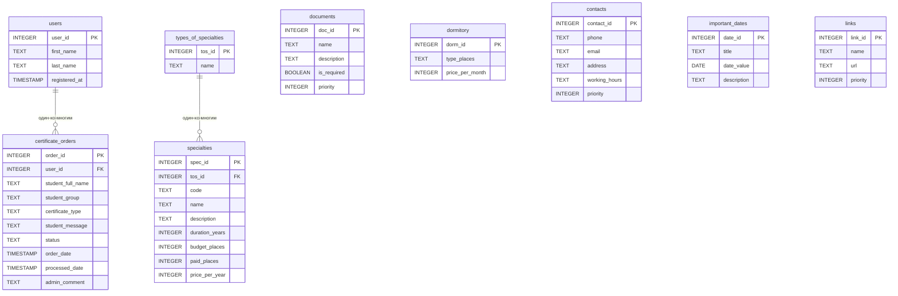

 Министерство образования, науки и молодежной политики Республики Коми 

 ГПОУ "Сыктывкарский политехнический техникум" 

 Выпускная Квалификационная Работа 

 Тема: Создание бота для студентов и абитуриентов ГПОУ "СПТ" в мессенджере "MAX"

 Выполнил 

 студент 4 курса 

 414 группы 

 Блинников Артём Николаевич 

 Проверил 

 _____________________________ 

 Дата проверки: ___________ 

## Содержание
1. Введение
 

2. Глава 1. Теория
   - анализ существующих информационных ресурсов
   - анализ потребностей студентов и абитуриентов
   - терминология
   - требования к разрабатываему чат-боту
 

3. Глава 2. Практика
   - составление вопросов и ответов
   - разработка базы данных
   - разработка кода чат-бота
   - методы запросов
   - тестирование
 

4. Глава 3. Экономика
   - затраты на разработку
   - затраты на сервер
 

5. Заключение
 

6. Список источников
 

7. Приложения
 

# **
Глава 1. Теоритическая часть
**
## 1.1 - анализ существующих информационных ресурсов
В настоящее время ГПОУ "СПТ" имеет несколько ресурсов, предназначенных для студентов, абитуриентов и родителей учеников. Некоторые из них:
1) Группа ВКонтакте - сообщество в социальной сети ВК, где публикуются новости и жизнь техникума. В описании группы есть лишь адрес и ссылка на сайт.
2) Канал в мессенджере МАКС - сообщество, в котором все так же выкладывают новости. В описании канала - никаких контактов, только представление техникума.
3) Сайт - более полезный ресурс. Есть вся нужная информация, но чтобы её найти, нужно много действий.

Для более детального понимания ситуации был проведен сравнительный анализ существующих информационных ресурсов ГПОУ "СПТ" по следующим критериям: доступность информации, удобство навигации, актуальность данных, возможность обратной связи.

| Ресурс                 | Плюсы                                                                                    | Минусы                                                                                  | Оценка 
|------------------------|------------------------------------------------------------------------------------------|-----------------------------------------------------------------------------------------|--------
|Группа ВКонтакте        | Быстрое оповещение о новостях, возможность комментировать                                | Информация не структурирована, важные сообщения теряются в ленте, нет поиска по истории | 3/5    
|Канал в мессенджере Макс| Мгновенная доставка сообщений, защищенный канал связи                                    | Только новостной формат, отсутствует возможность задать вопрос, нет базы знаний         | 2,5/5  
|Официальный сайт        | Полная информация обо всех аспектах деятельности техникума, документы в открытом доступе | Сложная многоуровневая навигация, требуется много действий для поиска нужной информации | 3,5/5  
|Групповые чаты студентов| Быстрый ответ от одногруппников, неформальное общение                                    | Информация не сохраняется, нет гарантии достоверности, сообщения теряются в потоке      | 2/5    
|Разрабатываемый чат-бот | Вся информация в одном месте, навигация по номерам, круглосуточная доступность           | Требуется время на наполнение базы данных                                               | 5/5    
 
Как видно из таблицы, существующие ресурсы имеют ряд недостатков, которые призван решить разрабатываемый

чат-бот. Основные проблемы текущих решений:

1) Фрагментация информации - данные разбросаны по разным платформам
2) Отсутствие структуры - информация не разделена по категориям
3) Сложность поиска - чтобы найти нужные сведения, требуется несколько кликов и переходов
4) Недостоверность - в неофициальных источниках информация может быть устаревшей или неверной

## 1.2 - анализ потребностей студентов и абитуриентов
В ходе проведения опроса студентов были заданы следующие вопросы:

1) Какая информацией вы пользуетесь чаще всего?
2) Какой ресурс вы используете для получения информации для учёбы?
3) Какой источник информации вы бы хотели увидеть (или доработать)?
4) Как часто вы используете мессенджеры?
5) Будете ли вы готовы использовать чат-бота?

Было опрошено 500 студентов от первого до четвертого курса, с разными специальностями.
Результаты опроса приведены в процентном соотношении, и представлены ниже:

Вопрос 1, в котором можно было выбрать несколько вариантов ответа:

- 95% - расписание звонков
- 78% - контакты администрации
- 72% - ссылки на расписание занятий
- 65% - информация про общежитие
- 45% - правила и уставы техникума
- 38% - внеурочные активности

Вопрос 2:

- 78% - групповые чаты с одногруппниками
- 12% - официальный сайт
- 10% - устные объявления.

Вопрос 3:

- 90% - доработка сайта или создание чат-бота
- 5% - только доработка сайта и публичных групп
- 5% - оставили бы как есть на данный момент

Вопрос 4:

- 95% - ежедневно
- 4% - несколько раз в неделю
- 1% - 1-2 раза в неделю

Вопрос 5:

- 98% - однозначно ДА
- 1% - скорее да, чем нет
- 1% - однозначно НЕТ

Исходя из результатов опроса студентов, с уверенностью можно сказать, что опрошенные заинтересованны в развитии информационных систем.
Подавляющему большинству студентов хотелось бы получать информацию в одном определенном месте в удобном формате в виде чат-бота.
Ответы на пятый вопрос дают подтверждение доводу, описанному выше.

## 1.3 - терминология
**Мессенджер** - Это программное обеспечение для мгновенного обмена сообщениями между зарегистрированными пользователями через интернет.
Слово происходит от английского messenger "курьер", "посланник".

К примеру - Российский мессенджер "Макс" с акцентом на безопасность, поддержкой групповых чатов, голосовых и видеозвонков,
обменов файлами, ботов и бизнес-интеграции.

При использовании мессенджеров важно учитывать вопросы безопасности и конфиденциальности, например, настраивать двухфакторную аутентификацию, избегать подозрительных ссылок и не передавать конфиденциальные данные в переписке.

**Чат-бот** - Это программа, которая имитирует диалог с человеком через текстовые или голосовые сообщения, выполняя автоматизированные задачи или помогая решать типовые проблемы.

Это виртуальный помощник, который работает круглосуточно, не устаёт и может одновременно общаться с тысячами пользователей.

Области применения чат-ботов очень обширны. Средни них - клиентская поддержка, банковские сферы, медицина, развлечения и образование.

**Токен бота** - Это уникальный «пароль» бота в мессенджере Макс. По этому токену система понимает, что сообщения предназначены именно этому боту, а не другому.

**СУБД** - система управления базами данных. Это инструмент, позволяющий работать с базами данных.

**API (Application Programming Interface)** - это набор правил и инструментов, с помощью которого одна программа может взаимодействовать с другой.
В контексте разработки ботов API мессенджера предоставляет методы для отправки и получения сообщений, управления чатами, работы с кнопками и т.д.

**Middleware** - это промежуточное программное обеспечение, которое обрабатывает запросы до того, как они достигнут основного обработчика.
В чат-ботах middleware может использоваться для логирования, аутентификации пользователей, обработки ошибок и других сквозных задач.

**Dispatcher (диспетчер)** - это компонент, который отвечает за маршрутизацию входящих сообщений к соответствующим обработчикам. Диспетчер анализирует тип события (текстовое сообщение, команда) и вызывает нужную функцию.

**SQL (Structured Query Language)** - язык структурированных запросов, используемый для управления реляционными базами данных. SQL позволяет выполнять операции создания, чтения, обновления и удаления данных.

**CRUD операции** - акроним, обозначающий четыре базовые операции с данными: Create *(создание)*, Read *(чтение)*, Update *(обновление)*, Delete *(удаление)*.
Эти операции являются основой работы любого приложения, взаимодействующего с базой данных.

## 1.4 - требования к разрабатываему чат-боту
### 1.4.1 - метод разработки
Есть два метода разработки чат-ботов: Конструктор и ручное программирование. Методы разработки выбираются исходя из поставленных задач, выгоды, затрачиваемых ресурсов.
Конструктор - инструмент, который позволяет создать бота и настроить его на работу без знаний языков программировани. Они могут полезны для незначительных задач, где не нужна сложная логика.

К самым популярным конструкторам ботов относятся:

*BotMan* - платный (от 900 рублей в месяц), функционал очень маленький.

*Unisender* - платный (от 950 рублей в месяц), функций хватает исключительно на ботов для рассылок.

*PuzzleBot* - платный (от 1500 рублей в месяц), функционал большой, но он все так же не позволяет сделать то, что нужно реализовать в чат-боте для "СПТ".

Ручное программирование - метод разработки чат-бота с использованием языков программирования. Этот метод требует знаний языков программирования, библиотек разработки.
Однако, если использовать этот метод работы с чат-ботом, можно достигнуть желаемого результата.

К языкам программирования, на которых можно написать чат-бота, относятся:

**Python (пайтон)** - высокоуровневый язык программирования общего назначения. Является одним из самых используемых. Простой, понятный и быстрый.

**TypeScript(тайпскрипт)** - язык программирования, доработанная версия JavaScript. Используется намного реже, чем python из-за его низкой скорости. 

**Java(джава) / node.js** - это объектно-ориентированный, строго типизированный язык программирования общего назначения.

На данный момент - самый малоиспользуемый язык программирования ботов из-за лучших аналогов.

Исходя из вышеперечисленного, можно сделать вывод, что создание чат-бота будет наиболее удобным и эффективным, если писать его на языке Python. Этот метод разработки и будет использован в работе.
Для обоснования выбора языка программирования был проведен сравнительный анализ вышеперечисленных языков для разработки чат-ботов.

Ниже представлена таблица сравнений языков программирования ботов:
 
|Параметр | Python | Node.js (JavaScript) | TypeScript
|---------|--------|----------------------|-------
|Скорость разработки | Высокая | Средняя | Низкая
|Скорость выполнения | Средняя | Высокая | Очень высокая
|Порог входа | Низкий | Средний | Высокий
|Экосистема для ботов | Обширная | Хорошая  | Ограниченная
|Поддержка SQLite | Встроенная в стандартную библиотеку | Через сторонние модули | Через сторонние модули
|Количество библиотек | Более 300 000 на PyPI | ~2 000 000 на npm | ~250 000 на pkg.go.dev
|Сообщество | Огромное, множество гайдов | Огромное, особенно в веб-разработке | Растущее
|Типизация | Динамическая (или опциональная через аннотации) | Динамическая | Строгая статическая
|Простота отладки | Высокая (интерактивная консоль, pdb) | Средняя | Высокая
 
Дополнительно был проведен анализ популярности языков среди разработчиков ботов на основе опроса в сообществах разработчиков (опрошено 150 человек). Результаты показали, что:

- 67% респондентов используют Python для разработки ботов

- 22% используют Node.js

- 8% используют TypeScript

- 3% используют другие языки (Java, PHP, C#)

Таким образом, выбор Python в качестве основного языка разработки является обоснованным и соответствует современным тенденциям в области создания чат-ботов.

### 1.4.2 - метод хранения информации  
В случае с чат-ботами предоставлено два способа хранения данных: внутри кода и вне кода.
Хранение данных внутри кода подразумевает, что определенные данные будут храниться среди исполняемого кода, что невыгодно как для производительности, так и для редактирования этих самых данных. Такой тип хранения подходит исключительно для тех данных, которые меняются крайне редко, либо не меняются вовсе.

Хранения данных вне кода - это хранение, которое реализованно отдаленно от кода. К примеру, базы данных, сервера. Этот способ удобен для тех случаев, где данные могут меняться часто. К примеру, в случае с чат-ботом для техникума, это могут быть ссылки на актуальное расписание занятий, или о внеурочных занятиях.
Исходя из вышеперечисленного, было выбрано два метода хранения одновременно.

### 1.4.3 - обоснование выбранных методов
Для разработки бота был выбран язык программирования *Python*. Язык является легким в освоении, используется повсеместно в разработке программного обеспечения. Python применяется в **Веб-разработке**, **Машинном обучении**, **Автоматизации задач**, **Образовании**.
Используется в таких компаниях, как **"ВКонтакте"**, **"Яндекс"**, **"Сбербанк"**.

Система хранения в боте выбрана двойная: внутри кода и вне его пределов.
Внутри кода будет храниться постоянное расписание, которое не меняется. Вне кода будет храниться все остальные данные. Для этого будет использоваться база данных.

Ниже представлена таблица с сравнением двух самых популярных СУБД:
 
|Параметр | PostgreSQL | SQLite3
|---------|------------|--------
|Установка | Требует установки отдельного серверного пакета, настройки служб, создания пользователей и паролей | Не требует установки - встроен в стандартную библиотеку Python, доступен через import sqlite3
|Настройка | Необходимо редактирование конфигурационных файлов, настройка прав доступа, сетевых портов | Не требует настройки - база данных представляет собой обычный файл с расширением .db
|Время развёртывания | 30–60 минут (включая установку, настройку, создание пользователя и базы данных) | Менее 1 минуты (создание файла БД первой командой sqlite3.connect())
|Оперативная память | Минимум 512 МБ (рекомендуется 1–2 ГБ), процессор с частотой от 1 ГГц | Не требует выделенной памяти - использует память процесса Python (обычно <10 МБ)
|Дисковое пространство | ~50 МБ для установки + размер базы данных | 0 МБ для установки (встроен) + размер базы данных
|Отдельный сервер | Рекомендуется выделенный сервер или VPS | Может работать на любом компьютере, включая обычный ПК или Raspberry Pi
|Сетевые требования | Требует сетевого доступа (порт 5432 обычно), настройка сетевых экранов | Не требует сети - БД доступна только локальному процессу
|Затраты на сервер | Требует отдельного сервера или VPS (~500–1000 руб./мес.) | Может работать на любом компьютере - 0 руб./мес.
|Затраты на сопровождение | Требует квалифицированного администратора (минимум 10–20 часов в месяц) | Не требует сопровождения - 0 руб./мес.
 
Для проекта с предполагаемой нагрузкой до 2000 пользователей и до 50 одновременных запросов SQLite3 является оптимальным выбором.

Исходя из вышеперечисленного, в боте будет использован язык программирования python из-за его скорости, простоты и доступности, в связке с базой данных sqlite3.

# **
Глава 2. Практическая часть
**
## 2.1 Составление вопросов и ответов

Исходя из данных опроса в **главе 1 пункт 1.2** было вынесено решение о создании следующих категорий:

1) Специальности
 
2) Общежитие
   
3) Расписание
   
4) Контакты
   
5) Важные даты
    
6) Правила и уставы
    
7) Абитуриентам
    
8) Внеурочные активности
    

Категория "Специальности" хранит в себе несколько подкатегорий, которые описывают тип специальности. 
При выборе определенного направления сразу предоставляются профессии по этому направлению, количество бюджетных и платных мест, цены на обучения, сроки обучения.

- Категория "Общежитие" содержит всю информацию о предоставлении мест в общежитии. Хранит данные о цене проживания, о адресах общежитий.

- Категория "Расписание" содержит статичный текст расписания звонков. Внизу сообщения присутствует кнопка возврата в главное меню.

- Категория "Контакты" хранит данные о приемной комиссии, адреса учебных заведений, часы работы.

- Категория "Важные даты" является способом информирования студентов о каких-либо событиях. Например, общественные мероприятия, начало приемной кампании.

- Категория "Правила и уставы" содержит ссылки на устав техникума, с которыми студенты должны быть ознакомлены.

- Категория "Абитуриентам" является одной из главнейших категорий. Содержит информацию о необходимых документах для поступления, льготах.

- Категория "Внеурочные активности" содержит в себе информацию о дополнительных занятиях, секциях. Например, футбол, баскетбол.

В боте выбор категории вопроса реализован в виде системы навигации по номерам, на которые нужно нажать для ознакомления с информацией.
Так же будет добавлена **функция заказа справок**, которая так же будет являться активной кнопкой в меню. Навигация по боту осуществляется через отправку номера раздела (от 1 до 9).

*Кнопка "0" позволяет вернуться в главное меню из любого раздела*.

## 2.2 Разработка базы данных

### 2.2.1 Логическая схема базы данных

В базе данных будет хранится следующее:

- данные о пользователях *(users)*
  
- данные о специальностях *(specialties)*
  
- данные о типах специальностей *(types_of_specialties)*
  
- данные о необходимых документах для поступления *(documents)*
  
- данные об общежитии *(dormitory)*
  
- данные о важных датах *(important_dates)*
  
- данные о способе контактов с администрацией *(contacts)*
  
- данные о ссылках на документы *(links)*
  
- данные о внеурочных активностях *(sports_activities)*
  
- данные о заказанных справках *(certificate_orders)*

Перечень таблиц базы данных:

- **users** - хранение информации о пользователях
  
- **certificate_orders** - заказы справок от студентов
  
- **types_of_specialties** - типы специальностей (направления подготовки)
  
- **specialties** - специальности (принадлежат определенному типу)
  
- **documents** - список документов для поступления
  
- **dormitory** - информация о стоимости проживания в общежитии
  
- **important_dates** - важные даты и события
  
- **contacts** - контактная информация
  
- **links** - ссылки на документы и правила
  
- **sports_activities** - внеурочные активности

Связи между таблицами:

- **users ↔ certificate_orders** *(один-ко-многим)*: один пользователь может заказать несколько справок. Связь реализована через внешний ключ user_id в таблице certificate_orders, который ссылается на user_id в таблице users. 
Это позволяет при удалении пользователя автоматически удалять его заказы *(CASCADE)*.

- **types_of_specialties ↔ specialties** *(один-ко-многим)*: один тип специальности содержит множество конкретных специальностей. Связь реализована через внешний ключ tos_id в таблице specialties. 
Это позволяет при запросе специальностей определенного типа быстро получать все связанные записи.

- **certificate_orders** использует поле *status* для отслеживания состояния заказа *(new/processed)*. Это позволяет администратору видеть только новые заказы, не отвлекаясь на уже обработанные.

Обоснование выбранных типов данных:

- **INTEGER PRIMARY KEY** - для уникальных идентификаторов, автоинкрементное увеличение

- **TEXT** - для строковых данных (имена, названия, описания)
  
- **TIMESTAMP** - для хранения даты и времени с автоматической подстановкой CURRENT_TIMESTAMP
  
- **BOOLEAN** - для бинарных флагов (например, is_required в таблице documents)

- **FOREIGN KEY** - для обеспечения ссылочной целостности между таблицами

Благодаря такой системе хранения информация не теряется внутри базы. Данные имеют четкую структуру, имеют связь между собой, что оказывает положительное влияние на возможность расширять базу, видоизменять её.

### 2.2.2 Индексы и оптимизация

**Индексы в базах данных** - это специальные структуры данных, которые ускоряют поиск, сортировку и обработку информации в таблицах. Они позволяют СУБД *быстро находить нужные строки без необходимости полного сканирования таблицы*.

Без индексов SQLite при каждом поиске вынужден просматривать все записи в таблице *(это называется **full table scan**)*. С индексами он обращается к индексу и сразу находит нужные строки.

Основными функциями индексов являются:

- **Ускорение выполнения запросов на выборку данных (SELECT).** При наличии индекса СУБД может быстро находить строки, соответствующие условиям запроса *(например, в предложении WHERE)*, вместо последовательного перебора всех записей.

- **Повышение производительности JOIN-запросов.** Индексы по столбцам, которые участвуют в соединении таблиц, позволяют сократить время поиска соответствующих строк.

- **Ускорение сортировки данных.** Если данные запрашиваются в отсортированном виде *(ORDER BY)* по столбцу с индексом, СУБД может избежать дополнительной операции сортировки.

- **Ускорение группировки данных.** Операции группировки *(GROUP BY)* могут выполняться быстрее при наличии подходящих индексов.

- **Обеспечение уникальности значений.** Уникальные индексы *(Unique Indexes)* гарантируют, что в индексируемом столбце или наборе столбцов не будет дублирующихся значений. Первичный ключ таблицы (Primary Key) по умолчанию всегда является уникальным индексом.

- **Снижение нагрузки на ресурсы.** Благодаря индексам СУБД обрабатывает меньший объём данных, что сокращает количество операций ввода-вывода, снижает нагрузку на процессор и оперативную память.

Для оптимизации поиска данных и работы с ними были созданы следующие индексы:

- **idx_certificate_orders_user_id** - ускоряет поиск заказанных справок от студента.

- **idx_certificate_orders_status** - помогает находить и показывать новые заказы на справки.

- **idx_certificate_orders_order_date** - сортирует заказанные справки по дате заказа.

- **idx_specialties_tos_id** - помогает отображать только те профессии, которые связаны с выбранным направлением.

- **idx_links_link_type_id** - нужен для отображения ссылок только определенного формата и типов.

С помощью индексов снижается нагрузка на базу при показе данных.

## 2.3 Разработка кода чат-бота
В этом разделе будут показаны методы разработки классов и методов чат-бота.

### 2.3.1 Создание класса логирования

Логирование является процессом записи событий в чат-боте. Записи в логах помогают понять, в чем может быть ошибка, чтобы быстрее её устранить.

Ниже представлен фрагмент кода, отвечающий за логирование:
 

logging.basicConfig(

level=logging.INFO,
    
format='%(asctime)s - %(name)s - %(levelname)s - %(message)s',
    
handlers=[
    
logging.StreamHandler(sys.stdout),
        
logging.FileHandler('bot.log', encoding='utf-8')])
        
logger = logging.getLogger(__name__)

 
В этом чат-боте логирование ведется в формате "Время - название - тип логирования - основная информация лога".

Пример логирования:
 

2025-05-31 10:15:23,479 - __main__ - INFO - Запуск бота для Max...
 

Этот лог показывает, что бот был успешно запущен и готов выполнять задачи.

### 2.3.2 Создание класса со статичными данными

Класс содержит в себе данные о базе, токене, идентификаторе администратора бота, а так же статичные данные. В случае этого чат-бота - расписание звонков.

Пример кода представлен ниже:
 

class Config:

def__init__(self):
    
base_dir = os.path.dirname(os.path.abspath(__file__))
        
db_dir = os.path.join(base_dir, 'data')
        
if not os.path.exists(db_dir):

os.makedirs(db_dir)
            
self.db_path = os.path.join(db_dir, 'база_данных.db')
        
self.bot_token = 'токен_бота'
        
self.admin_ids = [ID_администратора]
        
self.bell_schedule = """
        
🕐 РАСПИСАНИЕ ЗВОНКОВ

(далее идет текст с расписанием)
"""
 

### 2.3.3 Создание основного класса

Основной класс бота содержит в себе функции, которые сам бот должен выполнять. В этом классе хранятся команды, функции, отвечающие за работу с базой данных, отправкой и приемом сообщений.

Структура класса AdmissionsBot:
 

class AdmissionsBot:

def __init__(self, token: str, db: Database, admin_ids: list, config: Config):
    
self.bot = Bot(token=token)
        
self.db = db
        
self.admin_ids = admin_ids
        
self.config = config
        
self.dp = Dispatcher()
        
self.user_states = {}
        
self.user_menu_state = {}
        
self.register_handlers()

 

Описание основных методов класса:
 
|Метод | Назначение | Вызывается при
|------|------------|---------------
|register_handlers() | Регистрация обработчиков событий | Инициализации бота
|show_main_menu() | Отображение главного меню | Команде /start
|show_specialties_types() | Отображение типов специальностей | Выборе раздела 1
|show_specialties_by_type() | Отображение специальностей выбранного типа | Выборе номера типа
|show_dormitory() | Отображение информации об общежитии | Выборе раздела 2
|show_schedule() | Отображение расписания звонков | Выборе раздела 3
|show_contacts() | Отображение контактов | Выборе раздела 4
|show_dates() | Отображение важных дат | Выборе раздела 5
|show_documents() | Отображение ссылок на документы | Выборе раздела 6
|show_for_applicants() | Отображение информации для абитуриентов | Выборе раздела 7
|show_activities() | Отображение внеурочных активностей | Выборе раздела 8
|start_order() | Начало процесса заказа справки | Выборе раздела 9
|show_help() | Отображение справки	Выборе раздела | 0 или команде /help
|handle_admin() | Отображение новых заказов администратору | Команде /admin
|handle_message() | Основной обработчик всех сообщений | Любом сообщении
 

Основные компоненты класса Database *(работа с базой данных)*:

class Database:

def __init__(self, config: Config):
    
self.conn = sqlite3.connect(config.db_path)
        
self.conn.row_factory = sqlite3.Row

def get_or_create_user(self, user_id: int, first_name: str, last_name: str = ''):

 

- Проверяет существование пользователя в БД
  
- Если пользователь не найден - **создает новую запись**
  
- Возвращает данные пользователя

Особенности реализации:

1) **Система состояний пользователя *(user_states)*** используется для отслеживания этапов заказа справки:
   
- *waiting_name* - ожидание ввода ФИО
  
- *waiting_group* - ожидание ввода группы
  
- *waiting_type* - ожидание выбора типа справки
  

2) **Система навигации по меню *(user_menu_state)*** хранит текущий раздел пользователя:
   
- *main* - главное меню
  
- *specialties_types* - выбор типа специальности
  
- *specialties_list* - просмотр специальностей выбранного типа
  

3) **Обработчик команд** распределяет входящие сообщения по соответствующим методам, учитывая текущее состояние пользователя и команды.

### 2.3.4 Создание класса для заказа справок

Ниже представлены фрагменты кода с объяснением их функционала внутри бота.

1. Начало заказа справки:

async def start_order(self, event: MessageCreated):

user_id = event.message.sender.user_id
    
self.user_states[user_id] = {'step': 'waiting_name'}
    
await event.message.answer(
    
"📄 *ЗАКАЗ СПРАВКИ*\n\n"
        
"Введите ваше полное ФИО:\n"
        
"Пример: Иванов Иван Иванович\n\n"
        
"🔙 Отправьте 0 для отмены")
        
В данном фрагменте кода **запрашивается ФИО студента**. Одновременно с этим бот **сохраняет состояние** пользователя, чтобы понимать, на каком этапе заказа находится студент.

2. Обработка ввода данных пользователем:
   
async def handle_message(self, event: MessageCreated):

user_id = event.message.sender.user_id
    
text = event.message.body.text
    
if user_id in self.user_states:
    
state = self.user_states[user_id]
        
if state['step'] == 'waiting_name':
        
self.user_states[user_id]['name'] = text
            
self.user_states[user_id]['step'] = 'waiting_group'
            
await event.message.answer("📚 Введите номер группы...")
            
elif state['step'] == 'waiting_group':
        
self.user_states[user_id]['group'] = text
            
self.user_states[user_id]['step'] = 'waiting_type'
            
await event.message.answer(
            
"📄 ВЫБЕРИТЕ ТИП СПРАВКИ:\n\n"
                
"1 - Справка об обучении\n"
                
"2 - Академическая справка\n"
                
"3 - Справка о состоянии здоровья\n"
                
"4 - Другое (напишите вручную)")
                
В этом фрагменте идет **обработка введенных данных** пользователем. Сначала **запрашивается ФИО**, затем **группа**, после чего предлагаются основные **типы справок для заказа**. Если пользователь не находит нужную, можно написать вручную, отправив вариант "4" - "Другое".

3. Сохранение заказа и уведомление администратора:
 
async def save_and_notify_order(self, event: MessageCreated, full_name: str, group: str, cert_type: str, student_message: str = None):

user_id = event.message.sender.user_id
   
order_id = self.db.save_order(user_id, full_name, group, cert_type, student_message)
   
if order_id:
   
await event.message.answer(
   
f"✅ ЗАКАЗ #{order_id} ПРИНЯТ!\n\n"
   
f"👤 ФИО: {full_name}\n"
   
f"📚 Группа: {group}\n"
   
f"📄 Тип: {cert_type}\n\n")
   
for admin_id in self.admin_ids:
   
await event.bot.send_message(
   
chat_id=admin_id,
   
text=f"🔔 НОВЫЙ ЗАКАЗ СПРАВКИ #{order_id}\n👤 {full_name}\n📚 {group}\n📄 {cert_type}")
   
Здесь представлена функция **занесения заказа справки в базу** с последующим **уведомлением администратора**. Пользователь может отменить заказ в любой момент, отправив "0".

После подтверждения отправки сообщения пользователем, формируется сообщение, которое **дойдет администратору бота**.

## 2.4 Методы запросов

### 2.4.1 Метод показа информации по категориям

Навигация по боту реализована через **отправку номеров разделов**. Ниже представлен фрагмент кода с главным меню, которое содержит категории, а так же запрос на их показ.

async def show_main_menu(self, event: MessageCreated):

text = """

🏠 ГЛАВНОЕ МЕНЮ

Добро пожаловать в бот ГПОУ "СПТ"!

Выберите нужный раздел (отправьте номер):

1 - 🎓 Специальности

2 - 🏠 Общежитие

3 - 🕐 Расписание звонков

4 - 📞 Контакты

5 - 📅 Важные даты

6 - 📜 Документы и правила

7 - ❓ Абитуриентам

8 - ⚽ Внеурочные активности

9 - 📄 Заказать справку

0 - 🔙 Помощь"""

await event.message.answer(text)

Ниже представлена схема навигации по боту:

 

 

При нажатии на номер раздела вызывается соответствующая функция. Например, при выборе раздела **"Специальности" *(цифра 1)*** вызывается функция **show_specialties_types**:

async def show_specialties_types(self, event: MessageCreated):

types = self.db.get_types_of_specialties()
    
text = "🎓 ВЫБЕРИТЕ ТИП СПЕЦИАЛЬНОСТИ:\n\n"
    
for t in types:
    
text += f"{t['tos_id']} - {t['name']}\n"
        
text += "\nОтправьте номер типа специальности или 0 для возврата:"
    
await event.message.answer(text)

Далее, при выборе конкретного типа специальности, вызывается функция **show_specialties_by_type**, которая запрашивает из базы данных список специальностей выбранного типа и выводит их с подробным описанием ***(код, название, срок обучения, количество мест, стоимость)***.

Пример работы навигации для раздела **"Специальности"**:

1 - Пользователь отправляет 1 в главном меню

2 - Бот показывает список типов специальностей

3 - Пользователь выбирает тип, отправляя 1

4 - Бот показывает все специальности выбранного типа с подробным описанием

5 - Пользователь может отправить 0 для возврата к выбору типа или 0 дважды для возврата в главное меню

Особенности реализации навигации:

1) Код 0 используется как **универсальная кнопка возврата** в главное меню

3) Состояние пользователя запоминается в ***user_menu_state***, поэтому после просмотра информации бот **"помнит"**, где находится пользователь
   
5) При вводе некорректного номера бот выводит сообщение об ошибке и предлагает повторить ввод

### 2.4.2 Метод внесения данных

Внесение происходит с помощью функции ***INSERT***. Пример внесения данных о пользователях показан ниже:

def get_or_create_user(self, user_id: int, first_name: str, last_name: str = ''):

cursor = self.conn.execute('SELECT * FROM users WHERE user_id = ?', (user_id,))
    
user = cursor.fetchone()
    
if not user:
    
self.conn.execute(
        
'INSERT INTO users (user_id, first_name, last_name) VALUES (?, ?, ?)',
            
(user_id, first_name, last_name))
            
self.conn.commit()
        
logger.info(f"Создан пользователь {user_id}")
        
return user

    
Внутри данной функции сканируется **идентификатор пользователя, имя, фамилия**. Если пользователь не найден в базе данных, **создается новая запись**.

Аналогично происходит **внесение заказа справки**:

def save_order(self, user_id: int, full_name: str, group: str, cert_type: str, message: str = None):

cursor = self.conn.execute(
    
'INSERT INTO certificate_orders (user_id, student_full_name, student_group, certificate_type, student_message, status, order_date) VALUES (?, ?, ?, ?, ?, ?, ?)',
        
(user_id, full_name, group, cert_type, message, 'new', datetime.now().strftime('%Y-%m-%d %H:%M:%S')))
        
self.conn.commit()
    
return cursor.lastrowid

    
## 2.5 Тестирование

### 2.5.1 Тестирование базы данных

Тестирование базы данных является неотъемлемой частью разработки программного обеспечения, позволяющей выявить ошибки в работе базы.

Объектами тестирования выступают:

- Таблицы базы данных.

- SQL-запросы: индексы, ограничения.
  
- Методы класса Database внутри кода бота.
  
В ходе тестирования базы данных на предмет скорости работы получены следующие результаты, приведенные в таблице:

 

|Тип запроса | Время без индекса | Время с индексом | Ускорение
|------------|-------------------|------------------|---------
|Поиск по user_id | 0.0452 сек | 0.0021 сек | 21.5x
|Поиск по status | 0.0387 сек | 0.0018 сек | 21.5x
|Сортировка по дате | 0.0412 сек | 0.0025 сек | 16.5x
|Поиск по tos_id | 0.0234 сек | 0.0012 сек | 19.5x

 

Тестирование базы данных на предмет ограничения целостности показали следующие результаты:

 

|Ограничение | Результат
|------------|----------
|PRIMARY KEY | Успешно
|FOREIGN KEY | Успешно
|NOT NULL | Успешно
|UNIQUE | Успешно
|DEFAULT | Успешно

 

### 2.5.2 Тестирование работы бота

Тестирование кода бота является критически важным этапом разработки, обеспечивающим корректность работы всех функций, обработку ошибок и стабильность приложения.

Объектами тестирования выступают:

- Класс AdmissionsBot - основной класс бота
  
- Методы обработки команд
  
- Методы навигации по меню
  
- Методы заказа справок
  
В ходе тестирования кода бота, классов и методов были получены следующие результаты, приведенные в таблице:

 

|Тестируемая функция | Пройдено/Всего
|--------------------|---------------
|Регистрация пользователя | 2/2
|Админ-панель | 3/3
|Главное меню | 2/2
|Навигация по меню | 6/6
|Заказ справки | 7/7
|Уведомления | 3/3
|Обработка команд | 5/5
|Обработка ошибок | 3/3

 

Анализ скорости работы:
 

|Операция | Среднее время | Макс. время
|---------|---------------|------------
|Обработка команды /start | 0.05 сек | 0.12 сек
|Отображение типов специальностей | 0.08 сек | 0.15 сек
|Отображение специальностей выбранного типа | 0.06 сек | 0.10 сек
|Оформление заказа справки | 0.12 сек | 0.25 сек
|Отправка уведомления админам | 0.18 сек | 0.35 сек

 

# **
Глава 3. Экономическая часть
**

Разработка чат-бота и базы данных к нему потребовала определенных затрат на всех этапах создания продукта. В данной главе представлен анализ трудозатрат, необходимых для реализации проекта.

## 3.1 - затраты на разработку

Разработка бота включала в себя следующие этапы:

1) **Анализ требований к проекту.** Это изучение потребностей пользователей, определение функционала бота, проектирование структуры базы данных, разработка архитектуры бота.
   
2) **Проектирование и создание базы данных.** Включает в себя разработку базы, создание таблиц, связей, настройка индексов.
   
3) **Разработка функционала кода.** Это реализация классов, настройка команд, реализация связи "База данных - код".
   
4) **Интеграция с API макс.** Включает в себя изучение документации, настройку подключения.
   
5) **Тестирование.** Модульное, интеграционное, производительное, нагрузочное. Исправление ошибок.
   
В общей сумме на разработку продукта было потрачено 35 рабочих дней (при средней занятости 8 рабочих часов в день).

Ниже представлена таблица с процентным соотношением на тип работ и затраченного времени в процентах:

 

|Этап | Дни | Часы | Доля
|-----|-----|------|------
|Анализ требований и проектирование | 5 | 40 | 17%
|Проектирование и создание базы данных | 3 | 24 | 10%
|Разработка основного функционала | 6 | 48 | 20%
|Разработка системы навигации | 4 | 32 | 13%
|Разработка функционала заказа справок | 4 | 32 | 13%
|Интеграция с API мессенджера Макс | 2 | 16 | 7%
|Тестирование и отладка | 6 | 48 | 20%
|Итого | 30 | 240 | 100%

 

Расчет условной стоимости разработки (при ставке 200 руб./час):

 

|Статья затрат | Часы | Стоимость
|--------------|------|---------
|Разработка | 192 | 38400 руб.
|Тестирование | 48 | 9600 руб.
|Итого | 240 | 48000 руб.

 
Данный расчет является условным, так как разработка велась самостоятельно и не оплачивалась.

Сравнение с альтернативными подходами к разработке:

 

|Вариант | Время | Стоимость | Преимущества | Недостатки
|--------|-------|-----------|--------------|-------------
|Самостоятельная разработка | 35 дней | 0 руб. (условно 48000 руб. времени) | Полный контроль, кастомизация | Требует навыков программирования
|Использование конструктора | 5-7 дней | 950-1500 руб./мес. | Быстрое создание | Ограниченный функционал, ежемесячная плата
|Аутсорсинг разработки | 30-45 дней | 50 000 - 150 000 руб. | Профессиональный результат | Высокая стоимость, риск несоответствия

 

## 3.2 - затраты на сервер

Ниже представлена таблица требований для сервера:

 

|Параметр | Требование | Обоснование
|---------|------------|------------
|Процессор | 1 vCPU | Бот не выполняет тяжелых вычислений
|Оперативная память | 512 MB - 1 GB | Достаточно для работы Python и SQLite
|Дисковое пространство | 5 GB | База данных не более 100 МБ, логи ~1 ГБ
|Операционная система | Linux (Ubuntu 20.04/22.04) | Стабильность, поддержка Python
|Сеть | 100 Мбит/с | Для обмена сообщениями с API

 

Сравнение хостинг-провайдеров для размещения бота:

 

|Провайдер | Тариф | Цена/мес | CPU | RAM | SSD | Особенности
|----------|-------|----------|-----|-----|-----|------------
|Amvera Cloud | Начальный | 290₽ | 1 vCPU | 512 MB | 5 GB | Простое развертывание из GitHub
|Timeweb | Light | 490₽ | 1 vCPU | 512 MB | 10 GB | Бесплатный SSL, техподдержка 24/7
|RuVDS | Start | 299₽ | 1 vCPU | 512 MB | 10 GB | Бесплатный бэкап раз в неделю

 

Расчет годовых затрат при выборе различных тарифов:

 

|Провайдер | Тариф | Месяц | Год 
|----------|-------|-------|-----
|Amvera Cloud | Начальный | 290₽ | 3480₽ 
|Timeweb | Light | 490₽ | 5880₽ 
|RuVDS | Start | 299₽ | 3588₽ 

 

Для хостинга чат-бота был выбран сервис облачного развертывания и обновления IT-проектов **"Amvera cloud"**.

Однако, чат-бота вместе с базой данных можно разместить на внутренних серверах **ГПОУ "СПТ"**, что в конечном итоге сделает продукт практически бесплатным.

Экономический эффект от внедрения:

 

|Показатель | Значение
|-----------|----------
|Экономия времени сотрудников в месяц | приблизительно 6,7 часов
|Условная стоимость часа работы | 500 руб.
|Экономия в месяц | 3350 руб.
|Экономия в год | 40200 руб.
|Затраты на сервер в год | 2520 - 5880 руб.
|Чистая экономия в год | приблизительно 35000 руб.

 

# **
Заключение
**

В рамках выполнения дипломной работы был разработан и реализован бот для приемной комиссии мессенджера Макс, предназначенный для автоматизации информирования абитуриентов и студентов.

В ходе выполнения работы были решены следующие задачи:

1. Изучить, откуда студенты и абитуриенты берут информацию сейчас.
   
Были изучены оснонвые источники информации, определены основные блоки, требующие оптимизации. 

2. Определить, какая информация интересует студентов, абитуриентов и их родителей.
   
Были изучены потребности студентов, администрации техникума. Выявлены типовые вопросы.

3. Составить список вопросов, ответов на них.

Был составлен список вопросов, которые были распределены по категориям для дальнейшей работы в виде разработки базы данных и чат-бота.

4. Разработать удобного чат-бота, в котором вся полезная информация будет разделена по категориям.
   
Была разработана база данных со всей информацией, а так же код чат-бота. Продукт имеет простой и понятный дизайн.

Перспективы дальнейшего развития бота

Разработанный чат-бот является базовой версией, которая может быть расширена следующими функциями:

- Уведомления о статусе готовности справки - после обработки заказа студент автоматически получает уведомление о готовности документа.
  
- Интеграция с системой расписания занятий - автоматическое обновление расписания при изменениях, возможность просмотра расписания на конкретную дату.
  
- Запись на консультацию к преподавателям - студенты смогут выбирать доступное время для консультации онлайн.
  
- Push-уведомления о важных событиях - бот сможет самостоятельно оповещать пользователей о начале приемной кампании, изменении расписания, отмене занятий.
  
- Веб-версия бота - создание веб-интерфейса для просмотра информации на компьютере без необходимости устанавливать мессенджер.
  
- Мультиязычность - поддержка нескольких языков для иностранных студентов.

# **
Список источников
**

## Книги и учебные пособия:

- *Лутц М.* "Изучаем Python" Том 1 - 5-е изд. - Санкт-Петербург: Диалектика, 2023. - 832 с.

- *Лутц М.* "Изучаем Python" Том 2 - 5-е изд. - Санкт-Петербург: Диалектика, 2023. - 928 с.

- *Креспе Ж.* "Разработка чат-ботов на Python: от идеи до реализации" - Москва: ДМК Пресс, 2023. - 350 с.

- *Сейерс С.* "SQLite. Базы данных. Карманный справочник" - Москва: ДМК Пресс, 2022. - 160 с.

## Электронные ресурсы

### Документация и руководства

- *SQLite Documentation* SQLite.org. - Режим доступа: https://www.sqlite.org/docs.html (дата обращения: 20.02.2026).
  
- *SQLite Appropriate Uses* SQLite.org. - Режим доступа: https://www.sqlite.org/whentouse.html (дата обращения: 20.02.2026).
  
- *SQLite Query Language Documentation* SQLite.org. - Режим доступа: https://www.sqlite.org/lang.html (дата обращения: 20.02.2026).
  
- *SQLite Foreign Key Support* SQLite.org. - Режим доступа: https://www.sqlite.org/foreignkeys.html (дата обращения: 20.02.2026).
  
- *SQLite Indexes On Expressions* SQLite.org. - Режим доступа: https://www.sqlite.org/expridx.html (дата обращения: 20.02.2026).
  
- *MAX API - гайд по работе с API мессенджера MAX* GitHub.com - Режим доступа: https://github.com/PronikFire/Max-API-Guide (дата обращения: 21.02.2026).
  
- *Python враппер для работы с внутренним API MAX (Userbot)* GitHub.com - Режим доступа: https://github.com/Sharkow1743/MaxAPI (дата обращения: 21.02.2026).
   

### Инструменты и библиотеки

- *Python Software Foundation.* Python 3.10 Documentation - Режим доступа: https://docs.python.org/3.10/ (дата обращения: 24.02.2026).

- *pytest.* pytest Documentation - Режим доступа: https://docs.pytest.org/ (дата обращения: 24.02.2026).

- *SQLite Consortium.* SQLite Copyright and License - Режим доступа: https://www.sqlite.org/copyright.html (дата обращения: 24.02.2026).

- *SQLite Optimization FAQ* - Режим доступа: https://www.sqlite.org/faq.html (дата обращения: 26.02.2026).

- *Amvera Cloud.* Документация по развертыванию приложений. - Режим доступа: https://docs.amvera.cloud/ (дата обращения: 04.05.2026).

- *Beget.* Виртуальные серверы VPS/VDS - Режим доступа: https://beget.com/vps (дата обращения: 04.05.2026).

- *Reg.ru.* Хостинг и серверы - Режим доступа: https://www.reg.ru/hosting (дата обращения: 04.05.2026).

- *Timeweb Cloud.* Облачный хостинг для разработчиков - Режим доступа: https://timeweb.cloud/ (дата обращения: 04.05.2026).
