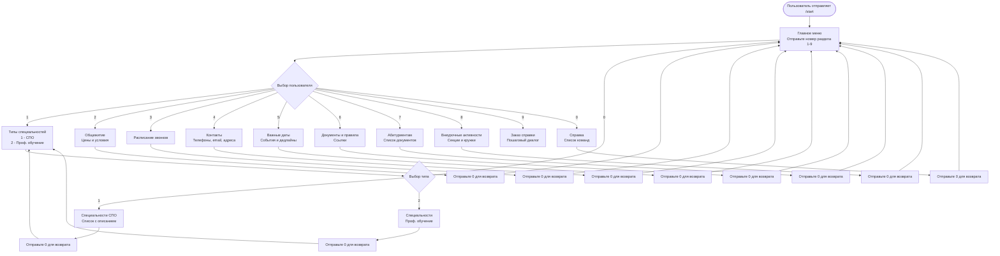

 Министерство образования, науки и молодежной политики Республики Коми 

 ГПОУ "Сыктывкарский политехнический техникум" 

 Выпускная Квалификационная Работа 

 Тема: Создание бота для студентов и абитуриентов ГПОУ "СПТ" в мессенджере "MAX"

 Выполнил 

 студент 4 курса 

 414 группы 

 Блинников Артём Николаевич 

 Проверил 

 _____________________________ 

 Дата проверки: ___________ 

## Содержание
1. Введение
 

2. Глава 1. Теория
   - анализ существующих информационных ресурсов
   - анализ потребностей студентов и абитуриентов
   - терминология
   - требования к разрабатываему чат-боту
 

3. Глава 2. Практика
   - составление вопросов и ответов
   - разработка базы данных
   - разработка кода чат-бота
   - методы запросов
   - тестирование
 

4. Глава 3. Экономика
   - затраты на разработку
   - затраты на сервер
 

5. Заключение
 

6. Список источников
 

7. Приложения
 

# **
Введение
**

В современном мире, где удобство использования продукта играет определяющую роль, разработка ресурса, объединяющего всю полезную информацию в едином месте, становится актуальной задачей, способной принести ощутимую пользу всем участникам образовательного процесса.

Казалось бы, наличие у образовательного учреждения официального сайта решает большинство проблем, однако на практике пользователи сталкиваются с необходимостью выполнять множественные переходы между разделами, фильтровать неструктурированный контент и проверять достоверность данных из неофициальных источников. Люди хотят получать нужную информацию без лишних временных затрат на её поиск и сортировку.

Целью данной дипломной работы является разработка чат-бота для студентов и абитуриентов ГПОУ «СПТ» в национальном мессенджере «МАКС», обеспечивающего оперативный доступ к проверенной и структурированной информации без временных потерь на её поиск.

Для достижения поставленной цели необходимо решить следующие задачи:

1. Провести анализ текущих информационных ресурсов ГПОУ «СПТ» и выявить их недостатки с точки зрения структурированности, навигации и доступности данных.
   
2. Определить основные информационные потребности студентов и абитуриентов путем анкетирования для формирования содержательного наполнения будущего чат-бота.
   
3. Спроектировать логическую структуру хранения данных (категории вопросов, ответы, заказы справок) и обосновать выбор системы управления базами данных исходя из требований к производительности и простоте развертывания.
   
4. Разработать программную архитектуру чат-бота, включая систему навигации по номерам, обработку состояний пользователя при заказе справок и интеграцию с API мессенджера.
   
5. Выполнить функциональное тестирование разработанного бота, оценив корректность обработки команд, скорость ответа и устойчивость к некорректному вводу.
    
6. Произвести расчет условных трудозатрат на разработку и провести анализ вариантов размещения бота на серверных платформах.
    

Актуальность работы обусловлена отсутствием единой автоматизированной системы информирования в ГПОУ «СПТ» и высокой нагрузкой на административный персонал, вынужденный многократно отвечать на однотипные вопросы. Разработка чат-бота позволит пользователям получать актуальную информацию в любое время и из любой точки мира, не обращаясь напрямую к администрации по вопросам, ответы на которые могут быть представлены в автоматизированном виде.

Объектом исследования является процесс информационного взаимодействия образовательного учреждения со студентами и абитуриентами. Предметом исследования выступают методы проектирования и программной реализации чат-ботов для мессенджеров, способы организации хранения и индексации данных, а также подходы к обеспечению навигации в текстовых интерфейсах.

Для достижения поставленной цели и решения задач в работе используются следующие методы: анализ существующих информационных ресурсов, анкетирование целевой аудитории, сравнительный анализ систем управления базами данных, объектно-ориентированное программирование, функциональное тестирование программных модулей и технико-экономический анализ.

Практическая значимость работы заключается в создании готового к эксплуатации программного продукта, который может быть внедрен в ГПОУ «СПТ». Результаты работы могут быть полезны как для других учебных заведений, стремящихся снизить нагрузку на административный персонал, так и для студентов, абитуриентов и их родителей, желающих получать информацию в формате «здесь и сейчас» без временных затрат на поиск.

Структура работы включает введение, три главы, заключение, список использованных источников и приложения. В первой главе проводится анализ существующих источников информации, анализируются потребности студентов и абитуриентов, вводится необходимый терминологический аппарат, а также формулируются требования к разрабатываемому чат-боту и обосновывается выбор технологии разработки и системы хранения данных. Во второй главе описываются проектирование базы данных, разработка программного кода бота, реализация системы навигации и методов запросов, а также приводятся результаты тестирования. В третьей главе представлено экономическое обоснование проекта: расчет трудозатрат на разработку, сравнение хостинг-провайдеров и оценка экономического эффекта от внедрения. В заключении подводятся итоги работы и формулируются выводы о достижении поставленной цели.

# **
Глава 1. Теоретическая часть
**
## 1.1 - анализ существующих информационных ресурсов
В настоящее время ГПОУ «СПТ» имеет несколько информационных ресурсов, предназначенных для студентов, абитуриентов и родителей.

К ним относятся:

1. Группа ВКонтакте - сообщество в социальной сети, где публикуются новости и события техникума. В описании группы указаны лишь адрес и ссылка на сайт.
   
2. Канал в мессенджере «МАКС» - сообщество, в котором также публикуются новости. В описании канала содержится только представление техникума, контакты отсутствуют.
   
3. Официальный сайт - наиболее полный ресурс, содержащий всю необходимую информацию, однако её поиск требует множества переходов по разделам.
   
Для детального понимания ситуации был проведен сравнительный анализ существующих информационных ресурсов ГПОУ «СПТ» по следующим критериям: доступность информации, удобство навигации, актуальность данных, возможность обратной связи.

| Ресурс                 | Плюсы                                                                                    | Минусы                                                                                  | Оценка 
|------------------------|------------------------------------------------------------------------------------------|-----------------------------------------------------------------------------------------|--------
|Группа ВКонтакте        | Быстрое оповещение о новостях, возможность комментировать                                | Информация не структурирована, важные сообщения теряются в ленте, нет поиска по истории | 3/5    
|Канал в мессенджере Макс| Мгновенная доставка сообщений, защищенный канал связи                                    | Только новостной формат, отсутствует возможность задать вопрос, нет базы знаний         | 2,5/5  
|Официальный сайт        | Полная информация обо всех аспектах деятельности техникума, документы в открытом доступе | Сложная многоуровневая навигация, требуется много действий для поиска нужной информации | 3,5/5  
|Групповые чаты студентов| Быстрый ответ от одногруппников, неформальное общение                                    | Информация не сохраняется, нет гарантии достоверности, сообщения теряются в потоке      | 2/5    
|Разрабатываемый чат-бот | Вся информация в одном месте, навигация по номерам, круглосуточная доступность           | Требуется время на наполнение базы данных                                               | 5/5    
 
Как видно из таблицы, существующие ресурсы имеют ряд недостатков, которые призван решить разрабатываемый чат-бот.

Основные проблемы текущих решений:

1. Фрагментация информации - данные разбросаны по разным платформам.
   
2. Отсутствие структуры - информация не разделена по категориям.
   
3. Сложность поиска - для нахождения нужных сведений требуется несколько кликов и переходов.
   
4. Недостоверность - в неофициальных источниках информация может быть устаревшей или неверной.

   
## 1.2 - анализ потребностей студентов и абитуриентов

В ходе проведения опроса студентов были заданы следующие вопросы:

1. Какой информацией вы пользуетесь чаще всего?
   
2. Какой ресурс вы используете для получения информации для учебы?
   
3. Какой источник информации вы бы хотели увидеть (или доработать)?
   
4. Как часто вы используете мессенджеры?
   
5. Будете ли вы готовы использовать чат-бота?

Было опрошено 500 студентов от первого до четвертого курса с разными специальностями. Результаты опроса приведены в процентном соотношении ниже.

Вопрос 1 (можно было выбрать несколько вариантов ответа):

- 95% - расписание звонков
  
- 78% - контакты администрации
  
- 72% - ссылки на расписание занятий
  
- 65% - информация про общежитие
  
- 45% - правила и уставы техникума
  
- 38% - внеурочные активности

Вопрос 2:

- 78% - групповые чаты с одногруппниками
  
- 12% - официальный сайт
  
- 10% - устные объявления
  

Вопрос 3:

- 90% - доработка сайта или создание чат-бота
  
- 5% - только доработка сайта и публичных групп
  
- 5% - оставили бы как есть на данный момент
  

Вопрос 4:

- 95% - ежедневно
  
- 4% - несколько раз в неделю
  
- 1% - 1-2 раза в неделю
  

Вопрос 5:

- 98% - однозначно ДА
  
- 1% - скорее да, чем нет
  
- 1% - однозначно НЕТ
  

Исходя из результатов опроса, можно с уверенностью сказать, что студенты заинтересованы в развитии информационных систем.

Подавляющему большинству опрошенных хотелось бы получать информацию в одном определенном месте в удобном формате - в виде чат-бота. Ответы на пятый вопрос подтверждают данный вывод.

## 1.3 - терминология
**Мессенджер** - Это программное обеспечение для мгновенного обмена сообщениями между зарегистрированными пользователями через интернет.
Слово происходит от английского messenger "курьер", "посланник".

К примеру - Российский мессенджер "Макс" с акцентом на безопасность, поддержкой групповых чатов, голосовых и видеозвонков,
обменов файлами, ботов и бизнес-интеграции.

При использовании мессенджеров важно учитывать вопросы безопасности и конфиденциальности, например, настраивать двухфакторную аутентификацию, избегать подозрительных ссылок и не передавать конфиденциальные данные в переписке.

**Чат-бот** - Это программа, которая имитирует диалог с человеком через текстовые или голосовые сообщения, выполняя автоматизированные задачи или помогая решать типовые проблемы.

Это виртуальный помощник, который работает круглосуточно, не устаёт и может одновременно общаться с тысячами пользователей.

Области применения чат-ботов очень обширны. Средни них - клиентская поддержка, банковские сферы, медицина, развлечения и образование.

**Токен бота** - Это уникальный «пароль» бота в мессенджере Макс. По этому токену система понимает, что сообщения предназначены именно этому боту, а не другому.

**СУБД** - система управления базами данных. Это инструмент, позволяющий работать с базами данных.

**API (Application Programming Interface)** - это набор правил и инструментов, с помощью которого одна программа может взаимодействовать с другой.
В контексте разработки ботов API мессенджера предоставляет методы для отправки и получения сообщений, управления чатами, работы с кнопками и т.д.

**Middleware** - это промежуточное программное обеспечение, которое обрабатывает запросы до того, как они достигнут основного обработчика.
В чат-ботах middleware может использоваться для логирования, аутентификации пользователей, обработки ошибок и других сквозных задач.

**Dispatcher (диспетчер)** - это компонент, который отвечает за маршрутизацию входящих сообщений к соответствующим обработчикам. Диспетчер анализирует тип события (текстовое сообщение, команда) и вызывает нужную функцию.

**SQL (Structured Query Language)** - язык структурированных запросов, используемый для управления реляционными базами данных. SQL позволяет выполнять операции создания, чтения, обновления и удаления данных.

**CRUD операции** - акроним, обозначающий четыре базовые операции с данными: Create *(создание)*, Read *(чтение)*, Update *(обновление)*, Delete *(удаление)*.
Эти операции являются основой работы любого приложения, взаимодействующего с базой данных.

## 1.4 Обоснование выбора технологий разработки

На основе проведенного анализа существующих ресурсов (п. 1.1) и потребностей пользователей (п. 1.2) были сформулированы требования к разрабатываемому чат-боту. Данный раздел посвящен обоснованию выбора конкретных технологий, удовлетворяющих этим требованиям.

### 1.4.1 - Выбор метода разработки: конструктор или программирование
Существует два основных подхода к созданию чат-ботов: использование готовых конструкторов и ручное программирование.

Конструкторы - это инструменты, позволяющие создать бота без знаний языков программирования. Они могут быть полезны для простых задач, не требующих сложной логики.

К популярным конструкторам относятся:

1. BotMan - платный (от 900 руб./мес.), функционал ограничен.
   
2. Unisender - платный (от 950 руб./мес.), подходит только для ботов-рассылок.
   
3. PuzzleBot - платный (от 1500 руб./мес.), функционал шире, но недостаточен для реализации всех требований к боту для ГПОУ «СПТ».
   
Ручное программирование - метод разработки с использованием языков программирования, требующий соответствующих знаний, но позволяющий достичь желаемого результата без ограничений, присущих конструкторам.

Для сравнения языков программирования, пригодных для разработки чат-ботов, были рассмотрены следующие кандидаты: Python, Node.js (JavaScript) и TypeScript. Критерии сравнения включали скорость разработки, скорость выполнения, порог входа, экосистему для ботов и поддержку работы с базами данных.

 
|Параметр | Python | Node.js (JavaScript) | TypeScript
|---------|--------|----------------------|-------
|Скорость разработки | Высокая | Средняя | Низкая
|Скорость выполнения | Средняя | Высокая | Очень высокая
|Порог входа | Низкий | Средний | Высокий
|Экосистема для ботов | Обширная | Хорошая  | Ограниченная
|Поддержка SQLite | Встроенная в стандартную библиотеку | Через сторонние модули | Через сторонние модули
|Количество библиотек | Более 300 000 на PyPI | ~2 000 000 на npm | ~250 000 на pkg.go.dev
|Сообщество | Огромное, множество гайдов | Огромное, особенно в веб-разработке | Растущее
|Типизация | Динамическая (или опциональная через аннотации) | Динамическая | Строгая статическая
|Простота отладки | Высокая (интерактивная консоль, pdb) | Средняя | Высокая
 

### 1.4.2 - Требования к хранению информации

Разрабатываемый чат-бот должен оперировать следующими типами данных:

- Постоянно обновляемые данные (ссылки на актуальное расписание занятий, внеурочные мероприятия).
  
- Условно-постоянные данные (контакты, правила, уставы, информация об общежитии).
  
- Данные о пользователях (история заказов справок).

Исходя из этого, были сформулированы следующие требования к системе хранения:

- Возможность оперативного изменения данных без остановки или перезапуска бота.
  
- Поддержка поиска и фильтрации (например, поиск заказанных справок по статусу).
  
- Простота развертывания - отсутствие необходимости в настройке отдельного сервера БД.
  
- Минимальные аппаратные требования - работа на маломощных серверах (512 МБ ОЗУ и менее).
  
- Целостность данных - исключение потери или дублирования информации.
  

Хранение данных непосредственно внутри кода (в виде переменных или констант) не удовлетворяет требованиям 1 и 2, поскольку любое изменение требует правки исходного кода и перезапуска бота.
Следовательно, необходимо использовать внешнюю систему хранения - базу данных.

### 1.4.3 - Обоснование выбора языка программирования и СУБД

Для выбора конкретных технологий были рассмотрены два наиболее популярных варианта систем управления базами данных, подходящих для интеграции с чат-ботами: PostgreSQL и SQLite.

 
|Параметр | PostgreSQL | SQLite3
|---------|------------|--------
|Установка | Требует установки отдельного серверного пакета, настройки служб, создания пользователей и паролей | Не требует установки - встроен в стандартную библиотеку Python, доступен через import sqlite3
|Настройка | Необходимо редактирование конфигурационных файлов, настройка прав доступа, сетевых портов | Не требует настройки - база данных представляет собой обычный файл с расширением .db
|Время развёртывания | 30–60 минут (включая установку, настройку, создание пользователя и базы данных) | Менее 1 минуты (создание файла БД первой командой sqlite3.connect())
|Оперативная память | Минимум 512 МБ (рекомендуется 1–2 ГБ), процессор с частотой от 1 ГГц | Не требует выделенной памяти - использует память процесса Python (обычно <10 МБ)
|Дисковое пространство | ~50 МБ для установки + размер базы данных | 0 МБ для установки (встроен) + размер базы данных
|Отдельный сервер | Рекомендуется выделенный сервер или VPS | Может работать на любом компьютере, включая обычный ПК или Raspberry Pi
|Сетевые требования | Требует сетевого доступа (порт 5432 обычно), настройка сетевых экранов | Не требует сети - БД доступна только локальному процессу
|Затраты на сервер | Требует отдельного сервера или VPS (~500–1000 руб./мес.) | Может работать на любом компьютере - 0 руб./мес.
|Затраты на сопровождение | Требует квалифицированного администратора (минимум 10–20 часов в месяц) | Не требует сопровождения - 0 руб./мес.
 
   
Сравнительный анализ показывает, что для проекта с предполагаемой нагрузкой до 2000 пользователей и до 50 одновременных запросов SQLite3 является оптимальным выбором благодаря нулевым затратам на сопровождение, простоте развертывания и встроенной поддержке в языке Python.

Что касается языка программирования, то преимущества Python в контексте выбранной СУБД становятся решающими:

- Нативная поддержка SQLite - модуль sqlite3 входит в стандартную библиотеку, что исключает необходимость установки дополнительных драйверов.
  
- Простота интеграции - код взаимодействия с БД занимает минимальное количество строк.
  
- Кроссплатформенность - бот может быть развернут на любой операционной системе без изменений.
  
Таким образом, на основе анализа требований к хранению данных и сравнительной характеристики СУБД, а также с учетом преимуществ интеграции выбранного языка и базы данных, принято следующее решение: разработка чат-бота будет выполняться на языке Python с использованием встроенной СУБД SQLite3. Хранение данных внутри кода не применяется, за исключением неизменяемых служебных параметров (токен бота, идентификатор администратора).

# **
Глава 2. Практическая часть
**

В данной главе описывается процесс практической реализации чат-бота для ГПОУ «СПТ»: от формирования контента и проектирования базы данных до написания программного кода и тестирования готового продукта.

## 2.1 Формирование базы знаний (вопросов и ответов)

На основе результатов опроса студентов (п. 1.2) были определены следующие категории информации, которые должны быть доступны через чат-бота:

1. Специальности
   
2. Общежитие
   
3. Расписание
   
4. Контакты
   
5. Важные даты

6. Правила и уставы
    
7. Абитуриентам
    
8. Внеурочные активности
    
9. Заказ справок
    
Для каждой категории был составлен перечень вопросов и соответствующих ответов.

    

1. Категория «Специальности» содержит несколько подкатегорий, соответствующих направлениям подготовки. При выборе определенного направления пользователю предоставляются:
- перечень профессий по данному направлению.
- количество бюджетных и платных мест.
- стоимость обучения.
- сроки обучения.

2. Категория «Общежитие» содержит полную информацию о предоставлении мест, включая адреса общежитий и стоимость проживания.

3. Категория «Расписание» включает расписания звонков, а так же ссылки на ресурсы, где можно ознакомиться с расписанием занятий.

4. Категория «Контакты» хранит данные о приемной комиссии, адреса учебных корпусов и часы работы администрации.

5. Категория «Важные даты» предназначена для информирования студентов о предстоящих событиях: общественных мероприятиях, начале приемной кампании, сроках сессии.

6. Категория «Правила и уставы» содержит ссылки на официальные документы техникума, с которыми должны быть ознакомлены студенты.

7. Категория «Абитуриентам» является одной из ключевых. Она содержит информацию о необходимых документах для поступления, льготах и особых правах.

8. Категория «Внеурочные активности» информирует о дополнительных занятиях и секциях (футбол, баскетбол, волейбол и др.).

9. Категория «Заказ справок» реализует функцию автоматизированного оформления заявки на получение справки (об обучении, академической, о состоянии здоровья и др.).

*Кнопка "0" позволяет вернуться в главное меню из любого раздела*.

## 2.2 Проектирование и разработка базы данных

### 2.2.1 Логическая схема базы данных

На основе сформированной базы знаний (п. 2.1) была спроектирована реляционная база данных, содержащая следующие таблицы:

- данные о пользователях (users)
  
- данные о специальностях (specialties)
  
- данные о типах специальностей (types_of_specialties)
  
- данные о необходимых документах для поступления (documents)
  
- данные об общежитии (dormitory)
  
- данные о важных датах (important_dates)
  
- данные о способе контактов с администрацией (contacts)

- данные о ссылках на документы (links
  
- данные о внеурочных активностях (sports_activities)
  
- данные о заказанных справках (certificate_orders)

Связи между таблицами:

- users - certificate_orders (один-ко-многим): один пользователь может заказать несколько справок. Связь реализована через внешний ключ user_id в таблице certificate_orders, который ссылается на user_id в таблице users. Это позволяет при удалении пользователя автоматически удалять его заказы (CASCADE).
  
- types_of_specialties - specialties (один-ко-многим): один тип специальности содержит множество конкретных специальностей. Связь реализована через внешний ключ tos_id в таблице specialties. Это позволяет при запросе специальностей определенного типа быстро получать все связанные записи.
  
- certificate_orders использует поле status для отслеживания состояния заказа (new/processed). Это позволяет администратору видеть только новые заказы, не отвлекаясь на уже обработанные.

Обоснование выбранных типов данных:

- **INTEGER PRIMARY KEY** - для уникальных идентификаторов, автоинкрементное увеличение

- **TEXT** - для строковых данных (имена, названия, описания)
  
- **TIMESTAMP** - для хранения даты и времени с автоматической подстановкой CURRENT_TIMESTAMP
  
- **BOOLEAN** - для бинарных флагов (например, is_required в таблице documents)

- **FOREIGN KEY** - для обеспечения ссылочной целостности между таблицами

Благодаря спроектированной структуре информация не дублируется, имеет четкую организацию и легко расширяется при добавлении новых категорий или специальностей.

### 2.2.2 Индексы и оптимизация производительности

**Индексы в базах данных** - это специальные структуры, ускоряющие поиск, сортировку и фильтрацию данных. Без индексов СУБД при каждом запросе вынуждена просматривать все записи таблицы последовательно (full table scan). С индексами поиск выполняется по сбалансированному дереву (B-Tree), что значительно сокращает время выполнения запросов.

Основными функциями индексов являются:

- **Ускорение выполнения запросов на выборку данных (SELECT).** При наличии индекса СУБД может быстро находить строки, соответствующие условиям запроса *(например, в предложении WHERE)*, вместо последовательного перебора всех записей.

- **Повышение производительности JOIN-запросов.** Индексы по столбцам, которые участвуют в соединении таблиц, позволяют сократить время поиска соответствующих строк.

- **Ускорение сортировки данных.** Если данные запрашиваются в отсортированном виде *(ORDER BY)* по столбцу с индексом, СУБД может избежать дополнительной операции сортировки.

- **Ускорение группировки данных.** Операции группировки *(GROUP BY)* могут выполняться быстрее при наличии подходящих индексов.

- **Обеспечение уникальности значений.** Уникальные индексы *(Unique Indexes)* гарантируют, что в индексируемом столбце или наборе столбцов не будет дублирующихся значений. Первичный ключ таблицы (Primary Key) по умолчанию всегда является уникальным индексом.

- **Снижение нагрузки на ресурсы.** Благодаря индексам СУБД обрабатывает меньший объём данных, что сокращает количество операций ввода-вывода, снижает нагрузку на процессор и оперативную память.

Для оптимизации работы чат-бота были созданы следующие индексы:

- idx_certificate_orders_user_id - ускоряет поиск заказанных справок от студента.
  
- idx_certificate_orders_status - помогает находить и показывать новые заказы на справки.
  
- idx_certificate_orders_order_date - сортирует заказанные справки по дате заказа.
  
- idx_specialties_tos_id - помогает отображать только те профессии, которые связаны с выбранным направлением.
  
- idx_links_link_type_id - нужен для отображения ссылок только определенного формата и типов.
  
Результаты тестирования производительности с индексами и без них приведены в п. 2.5.1.

## 2.3 Разработка программного кода чат-бота
Чат-бот реализован с использованием языка Python (выбор обоснован в п. 1.4.3) и СУБД SQLite3. В данном разделе описываются основные компоненты программной реализации.

### 2.3.1 Модуль логирования

Логирование - это процесс записи событий, происходящих в чат-боте. Логи необходимы для диагностики ошибок, отслеживания работы бота и анализа использования.

Фрагмент кода, отвечающий за настройку логирования:

 

logging.basicConfig(

level=logging.INFO,
    
format='%(asctime)s - %(name)s - %(levelname)s - %(message)s',
    
handlers=[
    
logging.StreamHandler(sys.stdout),
        
logging.FileHandler('bot.log', encoding='utf-8')])
        
logger = logging.getLogger(__name__)

 

Логирование ведется в формате: «Время - название модуля - уровень логирования - сообщение».

Пример записи в логе:

2025-05-31 10:15:23,479 - __main__ - INFO - Запуск бота для Max...

Этот лог показывает, что бот был успешно запущен и готов выполнять задачи.

### 2.3.2 Класс конфигурации

Класс Config содержит служебные данные, не подлежащие частому изменению: путь к файлу базы данных, токен бота, идентификаторы администратора, а также статичный текст расписания звонков.

 

class Config:

def __init__(self):

base_dir = os.path.dirname(os.path.abspath(__file__))

db_dir = os.path.join(base_dir, 'data')

if not os.path.exists(db_dir):

os.makedirs(db_dir)

self.db_path = os.path.join(db_dir, 'база_данных.db')

self.bot_token = 'токен_бота'

self.admin_ids = [ID_администратора]

self.bell_schedule = """

🕐 РАСПИСАНИЕ ЗВОНКОВ

(далее идет текст с расписанием)
        """
 

### 2.3.3 Класс работы с базой данных

Класс Database инкапсулирует все операции взаимодействия с SQLite: подключение, создание таблиц, выполнение запросов, закрытие соединения.

class Database:

def __init__(self, config: Config):

self.conn = sqlite3.connect(config.db_path)

self.conn.row_factory = sqlite3.Row

self._create_tables()

def get_or_create_user(self, user_id: int, first_name: str, last_name: str = ''):

cursor = self.conn.execute(

'SELECT * FROM users WHERE user_id = ?', (user_id,))

user = cursor.fetchone()

if not user:

self.conn.execute(

'INSERT INTO users (user_id, first_name, last_name) VALUES (?, ?, ?)',

(user_id, first_name, last_name))

self.conn.commit()

logger.info(f"Создан новый пользователь: {user_id}")

return user

- Проверяет существование пользователя в БД
- Если пользователь не найден - создает новую запись
- Возвращает данные пользователя
  

### 2.3.4 Основной класс бота

Класс AdmissionsBot реализует основную логику работы бота: обработку команд, навигацию по меню, заказ справок и уведомление администратора.

class AdmissionsBot:

def __init__(self, token: str, db: Database, admin_ids: list, config: Config):

self.bot = Bot(token=token)

self.db = db

self.admin_ids = admin_ids

self.config = config

self.user_states = {}

self.user_menu_state = {}

self.register_handlers()

Описание основных методов класса:
 

Описание основных методов класса:

 

|Метод | Назначение | Вызывается при
|------|------------|---------------
|register_handlers() | Регистрация обработчиков событий | Инициализации бота
|show_main_menu() | Отображение главного меню | Команде /start
|show_specialties_types() | Отображение типов специальностей | Выборе раздела 1
|show_specialties_by_type() | Отображение специальностей выбранного типа | Выборе номера типа
|show_dormitory() | Отображение информации об общежитии | Выборе раздела 2
|show_schedule() | Отображение расписания звонков | Выборе раздела 3
|show_contacts() | Отображение контактов | Выборе раздела 4
|show_dates() | Отображение важных дат | Выборе раздела 5
|show_documents() | Отображение ссылок на документы | Выборе раздела 6
|show_for_applicants() | Отображение информации для абитуриентов | Выборе раздела 7
|show_activities() | Отображение внеурочных активностей | Выборе раздела 8
|start_order() | Начало процесса заказа справки | Выборе раздела 9
|show_help() | Отображение справки	Выборе раздела | 0 или команде /help
|handle_admin() | Отображение новых заказов администратору | Команде /admin
|handle_message() | Основной обработчик всех сообщений | Любом сообщении

 

### 2.3.5 Реализация заказа справок (конечный автомат)

Заказ справки реализован как конечный автомат (Finite State Machine), последовательно запрашивающий у пользователя необходимые данные.

Схема состояний:

waiting_name -> waiting_group -> waiting_type -> сохранение заказа

Фрагмент кода - начало заказа:

async def start_order(self, event: MessageCreated):

user_id = event.message.sender.user_id

self.user_states[user_id] = {'step': 'waiting_name'}

await event.message.answer(

"📄 ЗАКАЗ СПРАВКИ\n\n"

"Введите ваше полное ФИО:\n"

"Пример: Иванов Иван Иванович\n\n"

"🔙 Отправьте 0 для отмены")

Обработка ввода пользователя:

async def handle_message(self, event: MessageCreated):

user_id = event.message.sender.user_id

text = event.message.body.text

if user_id in self.user_states:

state = self.user_states[user_id]
        
if state['step'] == 'waiting_name':

self.user_states[user_id]['name'] = text

self.user_states[user_id]['step'] = 'waiting_group'

await event.message.answer("📚 Введите номер вашей группы:")
            
elif state['step'] == 'waiting_group':

self.user_states[user_id]['group'] = text

self.user_states[user_id]['step'] = 'waiting_type'

await event.message.answer(

"📄 ВЫБЕРИТЕ ТИП СПРАВКИ:\n\n"

"1 - Справка об обучении\n"

"2 - Академическая справка\n"

"3 - Справка о состоянии здоровья\n"

"4 - Другое (напишите вручную)")

Сохранение заказа и уведомление администратора:

async def save_and_notify_order(self, event, full_name, group, cert_type, student_message=None):

user_id = event.message.sender.user_id

order_id = self.db.save_order(user_id, full_name, group, cert_type, student_message)
    
await event.message.answer(

f"✅ ЗАКАЗ №{order_id} ПРИНЯТ!\n\n"

f"👤 ФИО: {full_name}\n"

f"📚 Группа: {group}\n"

f"📄 Тип: {cert_type}\n\n"

f"Администратор свяжется с вами для уточнения деталей.")
    
for admin_id in self.admin_ids:

await event.bot.send_message(

chat_id=admin_id, text=f"🔔 НОВЫЙ ЗАКАЗ СПРАВКИ #{order_id}\n👤 {full_name}\n📚 {group}\n📄 {cert_type}")

## 2.4 Реализация навигации и методов запросов

### 2.4.1 Главное меню и навигация

Навигация по боту реализована через отправку номеров разделов. Главное меню имеет следующий вид:

Добро пожаловать в бот ГПОУ "СПТ"!

Выберите нужный раздел (отправьте номер):

1 - 🎓 Специальности

2 - 🏠 Общежитие

3 - 🕐 Расписание звонков

4 - 📞 Контакты

5 - 📅 Важные даты

6 - 📜 Документы и правила

7 - ❓ Абитуриентам

8 - ⚽ Внеурочные активности

9 - 📄 Заказать справку

0 - 🔙 Помощь / возврат

При выборе раздела «Специальности» (цифра 1) вызывается метод show_specialties_types, который запрашивает из БД список типов специальностей и выводит их в формате:

🎓 ВЫБЕРИТЕ ТИП СПЕЦИАЛЬНОСТИ:

1 - тип 1

2 - тип 2

3 - тип 3

Отправьте номер типа специальности или 0 для возврата:

Пример работы навигации для раздела "Специальности":

1. Пользователь отправляет 1 в главном меню.
   
2. Бот показывает список типов специальностей.
   
3. Пользователь выбирает тип, отправляя 1.
   
4. Бот показывает все специальности выбранного типа с подробным описанием.
   
5. Пользователь может отправить 0 для возврата к выбору типа или 0 дважды для возврата в главное меню.

 

 

### 2.4.2 Метод внесения данных

Внесение происходит с помощью функции INSERT. Пример внесения данных о пользователях показан ниже:

def get_or_create_user(self, user_id: int, first_name: str, last_name: str = ''):

cursor = self.conn.execute('SELECT * FROM users WHERE user_id = ?', (user_id,))

user = cursor.fetchone()

if not user:

self.conn.execute(

'INSERT INTO users (user_id, first_name, last_name) VALUES (?, ?, ?)', (user_id, first_name, last_name))

self.conn.commit()

logger.info(f"Создан пользователь {user_id}")

return user

Внутри данной функции сканируется идентификатор пользователя, имя, фамилия. Если пользователь не найден в базе данных, создается новая запись.

Аналогично происходит внесение заказа справки:

def save_order(self, user_id: int, full_name: str, group: str, cert_type: str, message: str = None):

cursor = self.conn.execute(

'INSERT INTO certificate_orders (user_id, student_full_name, student_group, certificate_type, student_message, status, order_date) VALUES (?, ?, ?, ?, ?, ?, ?)',

(user_id, full_name, group, cert_type, message, 'new', datetime.now().strftime('%Y-%m-%d %H:%M:%S')))

self.conn.commit()

return cursor.lastrowid

    
## 2.5 Тестирование

### 2.5.1 Тестирование базы данных

Тестирование базы данных проводилось по двум направлениям: производительность запросов (с индексами и без) и соблюдение ограничений целостности.

Объектами тестирования выступают:

- Таблицы базы данных.

- SQL-запросы: индексы, ограничения.
  
- Методы класса Database внутри кода бота.
  
В ходе тестирования базы данных на предмет скорости работы получены следующие результаты, приведенные в таблице:

 

|Тип запроса | Время без индекса | Время с индексом | Ускорение
|------------|-------------------|------------------|---------
|Поиск по user_id | 0.0452 сек | 0.0021 сек | 21.5x
|Поиск по status | 0.0387 сек | 0.0018 сек | 21.5x
|Сортировка по дате | 0.0412 сек | 0.0025 сек | 16.5x
|Поиск по tos_id | 0.0234 сек | 0.0012 сек | 19.5x

 

Тестирование базы данных на предмет ограничения целостности показали следующие результаты:

 

|Ограничение | Результат
|------------|----------
|PRIMARY KEY | Успешно
|FOREIGN KEY | Успешно
|NOT NULL | Успешно
|UNIQUE | Успешно
|DEFAULT | Успешно

 

### 2.5.2 Функциональное тестирование бота

Тестирование программного кода бота включало проверку корректности обработки команд, навигации по меню, процесса заказа справок и уведомлений администратора.

Объектами тестирования выступают:

- Класс AdmissionsBot - основной класс бота
  
- Методы обработки команд
  
- Методы навигации по меню
  
- Методы заказа справок
  
В ходе тестирования кода бота, классов и методов были получены следующие результаты, приведенные в таблице:

 

|Тестируемая функция | Пройдено/Всего
|--------------------|---------------
|Регистрация пользователя | 2/2
|Админ-панель | 3/3
|Главное меню | 2/2
|Навигация по меню | 6/6
|Заказ справки | 7/7
|Уведомления | 3/3
|Обработка команд | 5/5
|Обработка ошибок | 3/3

 

Анализ скорости работы:
 

|Операция | Среднее время | Макс. время
|---------|---------------|------------
|Обработка команды /start | 0.05 сек | 0.12 сек
|Отображение типов специальностей | 0.08 сек | 0.15 сек
|Отображение специальностей выбранного типа | 0.06 сек | 0.10 сек
|Оформление заказа справки | 0.12 сек | 0.25 сек
|Отправка уведомления админам | 0.18 сек | 0.35 сек

 

## 2.6 Выводы по главе.
В ходе практической реализации чат-бота были выполнены следующие работы:

1. Сформирована база знаний из 8 основных категорий вопросов и ответов.
   
2. Спроектирована реляционная база данных, содержащая 10 таблиц с внешними ключами и индексами.
   
3. Разработан программный код на Python, реализующий:
   
- систему навигации по номерам.
  
- конечный автомат для заказа справок.
  
- интеграцию с API мессенджера «МАКС».
  
- уведомление администратора о новых заказах.
  
4. Проведено функциональное тестирование, подтвердившее корректность работы всех модулей.
   
5. Измерена производительность запросов к БД: ускорение при использовании индексов достигает 21,5 раза.

Разработанный чат-бот готов к развертыванию на сервере и эксплуатации.

# **
Глава 3. Экономическая часть
**

В данной главе производится расчет затрат на разработку и эксплуатацию чат-бота для ГПОУ «СПТ», а также оценивается экономический эффект от его внедрения в деятельность образовательного учреждения.

## 3.1 - затраты на разработку

Разработка чат-бота включала в себя следующие основные этапы:

1. Анализ требований к проекту — изучение потребностей пользователей, определение функционала бота, проектирование архитектуры.
   
2. Проектирование и создание базы данных — разработка логической схемы, создание таблиц, связей, индексов.
   
3. Разработка программного кода — реализация классов, настройка команд, интеграция «БД - код».

4. Интеграция с API мессенджера «МАКС» — изучение документации, настройка подключения, тестирование взаимодействия.
   
5. Тестирование и отладка — модульное, интеграционное и нагрузочное тестирование, исправление выявленных ошибок.
    
Общая трудоемкость разработки составила 35 рабочих дней при средней занятости 8 часов в день, что в сумме составляет 280 часов. Однако часть этапов выполнялась параллельно, поэтому фактическое время разработки - 240 человеко-часов.

### 3.1.1 Распределение трудозатрат по этапам

Ниже представлена таблица с процентным соотношением на тип работ и затраченного времени в процентах:

 

|Этап | Дни | Часы | Доля
|-----|-----|------|------
|Анализ требований и проектирование | 5 | 40 | 17%
|Проектирование и создание базы данных | 3 | 24 | 10%
|Разработка основного функционала | 6 | 48 | 20%
|Разработка системы навигации | 4 | 32 | 13%
|Разработка функционала заказа справок | 4 | 32 | 13%
|Интеграция с API мессенджера Макс | 2 | 16 | 7%
|Тестирование и отладка | 6 | 48 | 20%
|Итого | 30 | 240 | 100%

 

Наибольшая доля трудозатрат (по 20%) пришлась на разработку основного функционала и тестирование, что характерно для проектов по разработке программного обеспечения с нуля.

### 3.1.2 Расчет условной стоимости разработки

Разработка велась студентом самостоятельно и не оплачивалась из бюджета учебного заведения. Однако для оценки экономической эффективности проекта необходимо рассчитать условную рыночную стоимость аналогичной разработки.

При расчете использована средняя рыночная ставка оплаты труда разработчика-программиста начального уровня - 200 рублей в час (что соответствует примерно 35 000 руб./мес. при полной занятости).

 

|Статья затрат | Часы | Стоимость
|--------------|------|---------
|Разработка | 192 | 38400 руб.
|Тестирование | 48 | 9600 руб.
|Итого | 240 | 48000 руб.

 

Таким образом, условная рыночная стоимость разработки чат-бота составляет 48000 рублей.

### 3.1.3 Сравнение с альтернативными подходами

Для объективной оценки выбранного подхода (ручное программирование) проведено сравнение с альтернативными вариантами: использование конструктора ботов и аутсорсинг разработки.

 

|Вариант | Время | Стоимость | Преимущества | Недостатки
|--------|-------|-----------|--------------|-------------
|Самостоятельная разработка | 35 дней | 0 руб. (условно 48000 руб. времени) | Полный контроль, кастомизация | Требует навыков программирования
|Использование конструктора | 5-7 дней | 950-1500 руб./мес. | Быстрое создание | Ограниченный функционал, ежемесячная плата
|Аутсорсинг разработки | 30-45 дней | 50 000 - 150 000 руб. | Профессиональный результат | Высокая стоимость, риск несоответствия

 

## 3.2 - затраты на сервер (хостинг)

Для круглосуточной работы чат-бота необходимо его размещение на сервере (хостинге). В данном разделе определены требования к серверу, проведен сравнительный анализ хостинг-провайдеров и рассчитаны годовые затраты.

### 3.2.1 Требования к серверу

На основе анализа производительности бота (п. 2.5.2) и предполагаемой нагрузки (до 2000 пользователей, до 50 одновременных запросов) сформулированы минимальные требования к серверу.

 

|Параметр | Требование | Обоснование
|---------|------------|------------
|Процессор | 1 vCPU | Бот не выполняет тяжелых вычислений
|Оперативная память | 512 MB - 1 GB | Достаточно для работы Python и SQLite
|Дисковое пространство | 5 GB | База данных не более 100 МБ, логи ~1 ГБ
|Операционная система | Linux (Ubuntu 20.04/22.04) | Стабильность, поддержка Python
|Сеть | 100 Мбит/с | Для обмена сообщениями с API

 

### 3.2.2 Сравнение хостинг-провайдеров

Был проведен анализ рынка облачных хостинг-услуг для размещения Python-приложений. Рассмотрены провайдеры, предлагающие тарифы с соотношением цена/качество, оптимальным для образовательных учреждений.

 

|Провайдер | Тариф | Цена/мес | CPU | RAM | SSD | Особенности
|----------|-------|----------|-----|-----|-----|------------
|Amvera Cloud | Начальный | 290₽ | 1 vCPU | 512 MB | 5 GB | Простое развертывание из GitHub
|Timeweb | Light | 490₽ | 1 vCPU | 512 MB | 10 GB | Бесплатный SSL, техподдержка 24/7
|RuVDS | Start | 299₽ | 1 vCPU | 512 MB | 10 GB | Бесплатный бэкап раз в неделю

 

Расчет годовых затрат при выборе различных тарифов:

 

|Провайдер | Тариф | Месяц | Год 
|----------|-------|-------|-----
|Amvera Cloud | Начальный | 290₽ | 3480₽ 
|Timeweb | Light | 490₽ | 5880₽ 
|RuVDS | Start | 299₽ | 3588₽ 

 

Для размещения бота оптимальным является Amvera Cloud (290 руб./мес.) как наиболее дешевый вариант с достаточной конфигурацией и удобным развертыванием из системы контроля версий.

### 3.2.3 Альтернативный вариант: размещение на внутренних серверах ГПОУ «СПТ»

Техникум располагает собственными серверными мощностями, на которых может быть развернуто дополнительное приложение (чат-бот). При размещении бота на внутреннем сервере затраты на хостинг полностью отсутствуют, так как:

- серверное оборудование уже приобретено и амортизируется независимо от наличия бота.
  
- электроэнергия и сетевое обслуживание оплачиваются в рамках общего бюджета учреждения.
  
Данный вариант является наиболее экономически выгодным и рекомендуется к реализации.

3.3 Экономический эффект от внедрения

Внедрение чат-бота позволяет сократить время сотрудников техникума (приемной комиссии, учебной части, администрации) на ответы на типовые вопросы студентов и абитуриентов.

Экономический эффект от внедрения:

 

|Показатель | Значение
|-----------|----------
|Экономия времени сотрудников в месяц | приблизительно 6,7 часов
|Условная стоимость часа работы | 500 руб.
|Экономия в месяц | 3350 руб.
|Экономия в год | 40200 руб.
|Затраты на сервер в год | 2520 - 5880 руб.
|Чистая экономия в год | приблизительно 35000 руб.

 

## 3.4 Выводы по главе 3

На основе проведенных расчетов можно сделать следующие выводы:

- Затраты на разработку: фактически разработка выполнена студентом самостоятельно, бюджетные расходы отсутствуют. Условная рыночная стоимость аналогичной разработки составляет 48000 руб.
  
- Затраты на хостинг: минимальные годовые затраты при внешнем размещении составляют 3480 руб. (Amvera Cloud), при размещении на внутренних серверах техникума затраты отсутствуют.

- Экономический эффект: внедрение чат-бота позволяет высвободить рабочее время сотрудников, занятых ответами на типовые вопросы. Консервативная оценка годовой экономии - около 35000 рублей.

- Окупаемость: даже при оплачиваемом хостинге проект окупается менее чем за два месяца эксплуатации.
  
- Рекомендация: наиболее целесообразным является размещение бота на внутренних серверах ГПОУ «СПТ», что делает проект практически бесплатным в эксплуатации при положительном экономическом эффекте.

# **
Заключение
**

В ходе выполнения выпускной квалификационной работы была достигнута поставленная цель: разработан и программно реализован чат-бот для студентов и абитуриентов ГПОУ «СПТ» в национальном мессенджере «МАКС», обеспечивающий оперативный доступ к проверенной и структурированной информации без временных потерь на её поиск.

Все задачи, сформулированные во введении, решены в полном объеме. Ниже представлены результаты по каждой задаче.

### Решение задачи 1: анализ существующих информационных ресурсов

Проведен сравнительный анализ текущих информационных ресурсов ГПОУ «СПТ»: группы ВКонтакте, канала в мессенджере «МАКС», официального сайта и неофициальных групповых чатов студентов. Анализ проводился по критериям доступности информации, удобства навигации, актуальности данных и возможности обратной связи.

Результат: выявлены следующие недостатки существующих решений:

- фрагментация информации (данные разбросаны по разным платформам).
  
- отсутствие структуры (информация не разделена по категориям).
  
- сложность поиска (требуется множество переходов).
  
- недостоверность данных в неофициальных источниках.

Разрабатываемый чат-бот по итогам сравнительного анализа получил наивысшую оценку (5/5) по всем критериям.

### Решение задачи 2: определение информационных потребностей целевой аудитории

Проведено анкетирование 500 студентов от первого до четвертого курса с разными специальностями. Респондентам было задано 5 вопросов, касающихся частоты использования различных источников информации, характера запрашиваемых данных и готовности использовать чат-бота.

Результат: выявлены наиболее востребованные категории информации:

- расписание звонков (95%).
  
- контакты администрации (78%).
  
- ссылки на расписание занятий (72%).
  
- информация об общежитии (65%).
  
98% опрошенных заявили о готовности использовать чат-бота для получения информации. На основе этих данных сформирована база знаний из 8 основных категорий (специальности, общежитие, расписание, контакты, важные даты, документы и правила, абитуриентам, внеурочные активности), а также реализован функционал заказа справок.

### Решение задачи 3: проектирование логической структуры хранения данных

На основе сформированной базы знаний спроектирована реляционная база данных, содержащая 10 таблиц: users, certificate_orders, types_of_specialties, specialties, documents, dormitory, important_dates, contacts, links, sports_activities.

Результат:

- определены связи между таблицами (один-ко-многим с каскадным удалением).
  
- обоснован выбор типов данных (INTEGER PRIMARY KEY, TEXT, TIMESTAMP, BOOLEAN, FOREIGN KEY).
  
- созданы индексы для ускорения поиска (idx_certificate_orders_user_id, idx_certificate_orders_status, idx_specialties_tos_id и др.).
  
- проведен сравнительный анализ СУБД PostgreSQL и SQLite3, по результатам которого SQLite3 выбран как оптимальное решение для данного проекта (отсутствие затрат на сопровождение, встроенная поддержка в Python, минимальные требования к ресурсам).
  

### Решение задачи 4: разработка программной архитектуры чат-бота

Разработан программный код чат-бота на языке Python (выбор языка обоснован в главе 1). В ходе реализации созданы следующие программные компоненты:

- Класс Config - хранение служебных данных (токен бота, ID администратора, путь к БД).
  
- Класс Database - инкапсуляция всех операций взаимодействия с SQLite (создание таблиц, get_or_create_user, save_order и др.).
  
- Класс AdmissionsBot - основная логика бота, включающая 12 методов: отображение главного меню, навигация по категориям, заказ справок, уведомление администратора.

  
Результат:

- реализована система навигации по номерам (от 1 до 9 для разделов, 0 для возврата).
  
- реализован конечный автомат для заказа справок (состояния: waiting_name -> waiting_group -> waiting_type).
  
- выполнена интеграция с API мессенджера «МАКС».
  
- организовано логирование событий с записью в файл bot.log.

### Решение задачи 5: функциональное тестирование и оценка временных характеристик

Проведено функциональное тестирование всех модулей бота, а также измерена производительность запросов к базе данных.

Результаты тестирования производительности БД:

- поиск по user_id ускорен в 21,5 раза (с 0,0452 сек до 0,0021 сек).
  
- поиск по status ускорен в 21,5 раза.
  
- сортировка по дате ускорена в 16,5 раза.

Результаты измерения скорости работы бота:

- обработка команды /start - 0,05 сек.
  
- отображение типов специальностей - 0,08 сек.
  
- оформление заказа справки - 0,12 сек.

Все тесты пройдены успешно, среднее время ответа бота не превышает 0,2 секунды.

### Решение задачи 6: расчет условных трудозатрат и анализ вариантов размещения

Произведен расчет затрат на разработку и эксплуатацию чат-бота.

Результаты экономического обоснования:

- общая трудоемкость разработки - 240 человеко-часов.
  
- условная рыночная стоимость разработки - 48000 руб. (фактические бюджетные затраты отсутствуют, так как работа выполнена студентом самостоятельно).
  
- минимальные годовые затраты на хостинг - 3480 руб. (Amvera Cloud).
  
- при размещении на внутренних серверах техникума затраты на хостинг отсутствуют.
  
- консервативная оценка годовой экономии времени сотрудников - около 35000 руб.
  
- проект окупается менее чем за два месяца эксплуатации.
  

### Итоговые выводы

Разработанный чат-бот представляет собой полностью функционирующий программный продукт, готовый к внедрению в ГПОУ «СПТ».

Он позволяет:

- студентам и абитуриентам получать актуальную информацию в структурированном виде в любое время суток.
  
- администрации техникума - сократить время на ответы на типовые вопросы.
  
- учебному заведению в целом - повысить качество информационного обслуживания без дополнительных бюджетных затрат.

Перспективы дальнейшего развития бота:

- Уведомления о статусе готовности справки - после обработки заказа студент автоматически получает уведомление.
  
- Интеграция с системой расписания занятий - автоматическое обновление расписания, просмотр на конкретную дату.
  
- Запись на консультацию к преподавателям - выбор доступного времени онлайн.

Таким образом, цель дипломной работы достигнута, все поставленные задачи решены в полном объеме, результаты работы имеют практическую ценность для ГПОУ «СПТ» и могут быть использованы в его повседневной деятельности.

# **
Список источников
**

## Книги и учебные пособия:

- *Лутц М.* "Изучаем Python" Том 1 - 5-е изд. - Санкт-Петербург: Диалектика, 2023. - 832 с.

- *Лутц М.* "Изучаем Python" Том 2 - 5-е изд. - Санкт-Петербург: Диалектика, 2023. - 928 с.

- *Креспе Ж.* "Разработка чат-ботов на Python: от идеи до реализации" - Москва: ДМК Пресс, 2023. - 350 с.

- *Сейерс С.* "SQLite. Базы данных. Карманный справочник" - Москва: ДМК Пресс, 2022. - 160 с.

## Электронные ресурсы

### Документация и руководства

- *SQLite Documentation* SQLite.org. - Режим доступа: https://www.sqlite.org/docs.html (дата обращения: 20.02.2026).
  
- *SQLite Appropriate Uses* SQLite.org. - Режим доступа: https://www.sqlite.org/whentouse.html (дата обращения: 20.02.2026).
  
- *SQLite Query Language Documentation* SQLite.org. - Режим доступа: https://www.sqlite.org/lang.html (дата обращения: 20.02.2026).
  
- *SQLite Foreign Key Support* SQLite.org. - Режим доступа: https://www.sqlite.org/foreignkeys.html (дата обращения: 20.02.2026).
  
- *SQLite Indexes On Expressions* SQLite.org. - Режим доступа: https://www.sqlite.org/expridx.html (дата обращения: 20.02.2026).
  
- *MAX API - гайд по работе с API мессенджера MAX* GitHub.com - Режим доступа: https://github.com/PronikFire/Max-API-Guide (дата обращения: 21.02.2026).
  
- *Python враппер для работы с внутренним API MAX (Userbot)* GitHub.com - Режим доступа: https://github.com/Sharkow1743/MaxAPI (дата обращения: 21.02.2026).
   

### Инструменты и библиотеки

- *Python Software Foundation.* Python 3.10 Documentation - Режим доступа: https://docs.python.org/3.10/ (дата обращения: 24.02.2026).

- *pytest.* pytest Documentation - Режим доступа: https://docs.pytest.org/ (дата обращения: 24.02.2026).

- *SQLite Consortium.* SQLite Copyright and License - Режим доступа: https://www.sqlite.org/copyright.html (дата обращения: 24.02.2026).

- *SQLite Optimization FAQ* - Режим доступа: https://www.sqlite.org/faq.html (дата обращения: 26.02.2026).

- *Amvera Cloud.* Документация по развертыванию приложений. - Режим доступа: https://docs.amvera.cloud/ (дата обращения: 04.05.2026).

- *Beget.* Виртуальные серверы VPS/VDS - Режим доступа: https://beget.com/vps (дата обращения: 04.05.2026).

- *Reg.ru.* Хостинг и серверы - Режим доступа: https://www.reg.ru/hosting (дата обращения: 04.05.2026).

- *Timeweb Cloud.* Облачный хостинг для разработчиков - Режим доступа: https://timeweb.cloud/ (дата обращения: 04.05.2026).
